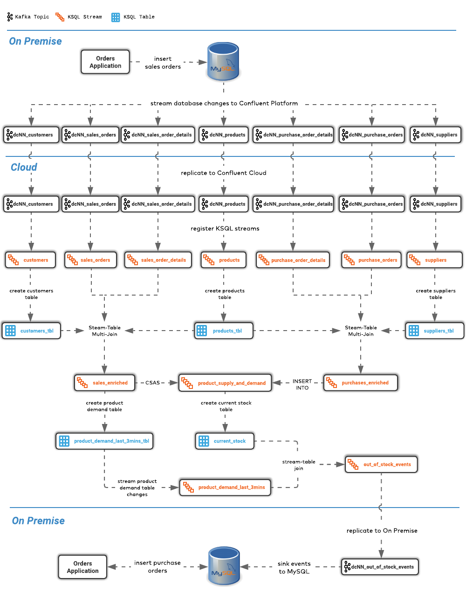

# Confluent Hybrid-Cloud Workshop

## Overview

This repository allows you to configure and provision a cloud-based workshop using your preferred cloud provider GCP, AWS or Azure. Each workshop participant connects to their own virtual machine and is intended to act as a psuedo on-premise datacenter. A single Confluent Cloud cluster is shared by all workshop participants.

For a single workshop participant, the logical architecture looks like this.


From a physical architecture point of view, each component, except for Confluent Cloud, is hosted on the participant's virtual machine. 

Each workshop participant will work through a series of Labs to create the following ksqlDB Supply & Demand Application.



## Prerequisites

* macOS or Linux
* Terraform 0.12.20 or later
* Python + [Yaml](https://pyyaml.org/wiki/PyYAML)
* A GCP/AWS/Azure account with the appropriate privileges
* A Confluent Cloud Account
* [MongoDB Realm CLI](https://docs.mongodb.com/realm/deploy/realm-cli-reference/#installation) (required if you use the MongoDB Atlas extension)

## Provisioning a Workshop

Create an empty directory somewhere that will contain your workshop configuration file.

```
mkdir ~/myworkshop
```

Copy `workshop-example-<cloud provider>.yaml` to `workshop.yaml` in the directory you just created.

```
cp workshop-<cloud provider>-example.yaml ~/myworkshop/workshop.yaml
```

Edit `~/myworkshop/workshop.yaml` and make the required changes.

Change your current directory to the root of the repository

```
cd ~/confluent-hybrid-cloud-workshop
```

To start provisioning the workshop, run `workshop-create.py` and pass in your workshop directory

```
python workshop-create.py --dir ~/myworkshop
```

When you are finished with the workshop you can destroy it using `workshop-destroy.py`

```
python workshop-destroy.py --dir ~/myworkshop
```

## License

This project is licensed under the Apache 2.0 - see the [LICENSE.md](LICENSE.md) file for details
