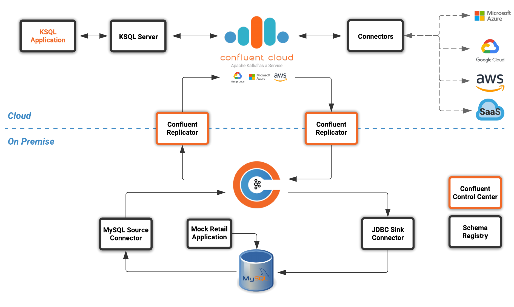

== Introduction

The popularity of Hybrid and Multi cloud architectures are on the rise as organizations continue to take advantage of cloud computing. 

Some of the requirements driving these new modern architectures are as follows.

*Organizations need to...*

* Synchronize data between on-premise and the cloud
* Migrate data from on-premise into the cloud
* Synchronize data across multiple cloud providers to reduce risk 
* Synchronize data across multiple cloud providers to avoid vendor lock-in 
* Access the best-in-breed services across multiple cloud providers

In addition to Hybrid and Multi cloud architectures, organizations are also looking to become more event driven. The Confluent Platform is a streaming platform that can stream data, in real time, to the systems that need it, when they need it, across an entire organization. Processes that were once batch can now become real time, every event can be used to trigger other services and this can all be done using a common API with low latency and high throughput.

In this workshop we will explore how the Confluent Platform and Confluent Cloud can enable these architectures by building a real time supply and demand appplication using ksqlDB.

