== Lab 1: Connecting to your Workshop Environment

Your environment represents an on-premise data center and consists of a virtual machine hosted in the cloud running several docker containers. In a real world implementation, some of the components would be deployed differently but the logical data flow that we will be working on would remain the same.

To login to your virtual data center open a terminal session and use the credentials that were assigned to you

[source,bash,subs=attributes+]
----
ssh {dc}@{externalip} 
----

Once logged in run the following command to confirm that you have several docker containers running
[source,bash,subs=attributes+]
----
docker ps --format "table {{.ID}}\t{{.Names}}\t{{.RunningFor}}\t{{.Status}}"
----

You should see something similar to this:-

[source,bash,subs=attributes+]
----
CONTAINER ID        NAMES                     CREATED             STATUS
d71e05e9b3b5        db-trans-simulator        6 minutes ago       Up 6 minutes
9100108345db        mysql                     6 minutes ago       Up 6 minutes (healthy)
e280fd878cce        ksql-cli                  7 minutes ago       Up 7 minutes
edcd99707a7a        ksql-server-ccloud        7 minutes ago       Up 7 minutes (healthy)
d6ca56beb72e        control-center            7 minutes ago       Up 7 minutes
31bf790e76e7        kafka-connect-ccloud      7 minutes ago       Up 7 minutes
8b35d343e6d6        kafka-connect-onprem      7 minutes ago       Up 7 minutes
4aa6a7cd76c3        schema-registry           7 minutes ago       Up 7 minutes
84022bbf75e5        broker                    7 minutes ago       Up 7 minutes
b0f2aefb2042        zookeeper                 7 minutes ago       Up 7 minutes
ee2983ac4bcc        workshop-docs-webserver   7 minutes ago       Up 7 minutes
----

== Lab 2: Getting Started

The data source for this workshop will be a MySQL database running in your data center. Connected to this database is a orders application which we will discuss shortly.

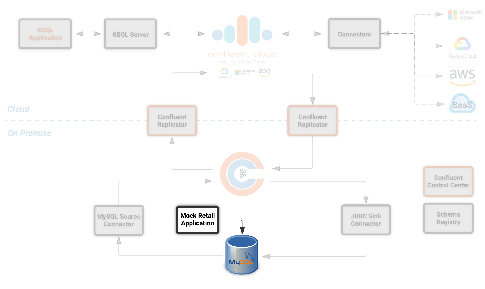

=== Database Schema

The MySQL database contains a simple schema that includes _Customer_, _Supplier_, _Product_, _Sales Order_ and _Purchase Order_ information. 

The idea behind this schema is simple, customers order products from a company and sales orders get created, the company then sends purchase orders to their suppliers so that product demand can be met by maintaining sensible stock levels.

image::./images/mysql_schema.png[MySQL schema]

We can inspect this schema further by logging into the MySQL CLI.

[source,bash]
----
docker exec -it mysql bash -c 'mysql -u root -p$MYSQL_ROOT_PASSWORD --database orders'
----

You should see the following
[source,bash]
----
Welcome to the MySQL monitor.  Commands end with ; or \g.
Your MySQL connection id is 1138
Server version: 5.7.27-log MySQL Community Server (GPL)

Copyright (c) 2000, 2019, Oracle and/or its affiliates. All rights reserved.

Oracle is a registered trademark of Oracle Corporation and/or its
affiliates. Other names may be trademarks of their respective
owners.

Type 'help;' or '\h' for help. Type '\c' to clear the current input statement.

mysql>
----

To view your tables.

[source,bash]
----
show tables;
----

There's an extra table here called `{dc}_out_of_stock_events` that not in the schema diagram above, we'll cover this table separately later on.

[source,bash,subs="attributes"]
----
+--------------------------+
| Tables_in_orders         |
+--------------------------+
| customers                |
| {dc}_out_of_stock_events |
| products                 |
| purchase_order_details   |
| purchase_orders          |
| sales_order_details      |
| sales_orders             |
| suppliers                |
+--------------------------+

----

...and get some row counts.

[source,bash]
----
SELECT * from (
  SELECT 'customers' as table_name, COUNT(*) FROM customers 
  UNION 
  SELECT 'products' as table_name, COUNT(*) FROM products 
  UNION 
  SELECT 'suppliers' as table_name, COUNT(*) FROM suppliers 
  UNION 
  SELECT 'sales_orders' as table_name, COUNT(*) FROM sales_orders 
  UNION 
  SELECT 'sales_order_details' as table_name, COUNT(*) FROM sales_order_details 
  UNION 
  SELECT 'purchase_orders' as table_name, COUNT(*) FROM purchase_orders 
  UNION 
  SELECT 'purchase_order_details' as table_name, COUNT(*) FROM purchase_order_details 
) row_counts;
----

As you can see, we have 30 customers, suppliers and products, 0 sales orders and 1 purchase order. 

[source,bash]
----
+------------------------+----------+
| table_name             | COUNT(*) |
+------------------------+----------+
| customers              |       30 |
| products               |       30 |
| suppliers              |       30 |
| sales_orders           |        0 |
| sales_order_details    |        0 |
| purchase_orders        |        1 |
| purchase_order_details |       30 |
+------------------------+----------+
7 rows in set (0.00 sec)
----

The single purchase order was created so we have something in stock to sell, let's have a look at what was ordered.

[source,sql]
----
SELECT * FROM purchase_order_details;
----

[source,bash]
----
+----+-------------------+------------+----------+------+
| id | purchase_order_id | product_id | quantity | cost |
+----+-------------------+------------+----------+------+
|  1 |                 1 |          1 |      100 | 6.82 |
|  2 |                 1 |          2 |      100 | 7.52 |
|  3 |                 1 |          3 |      100 | 6.16 |
|  4 |                 1 |          4 |      100 | 8.07 |
|  5 |                 1 |          5 |      100 | 2.10 |
|  6 |                 1 |          6 |      100 | 7.45 |
|  7 |                 1 |          7 |      100 | 4.02 |
|  8 |                 1 |          8 |      100 | 0.64 |
|  9 |                 1 |          9 |      100 | 8.51 |
| 10 |                 1 |         10 |      100 | 3.61 |
| 11 |                 1 |         11 |      100 | 2.62 |
| 12 |                 1 |         12 |      100 | 2.60 |
| 13 |                 1 |         13 |      100 | 1.26 |
| 14 |                 1 |         14 |      100 | 4.08 |
| 15 |                 1 |         15 |      100 | 3.56 |
| 16 |                 1 |         16 |      100 | 7.13 |
| 17 |                 1 |         17 |      100 | 7.64 |
| 18 |                 1 |         18 |      100 | 5.94 |
| 19 |                 1 |         19 |      100 | 2.94 |
| 20 |                 1 |         20 |      100 | 1.91 |
| 21 |                 1 |         21 |      100 | 8.89 |
| 22 |                 1 |         22 |      100 | 7.62 |
| 23 |                 1 |         23 |      100 | 6.19 |
| 24 |                 1 |         24 |      100 | 2.83 |
| 25 |                 1 |         25 |      100 | 5.51 |
| 26 |                 1 |         26 |      100 | 4.23 |
| 27 |                 1 |         27 |      100 | 8.33 |
| 28 |                 1 |         28 |      100 | 7.09 |
| 29 |                 1 |         29 |      100 | 1.75 |
| 30 |                 1 |         30 |      100 | 1.72 |
+----+-------------------+------------+----------+------+
30 rows in set (0.00 sec)
----

as you can see, we have ordered 100 of each product, this reflects our initial and current stock levels.

Type `exit` to leave the MySQL CLI

=== Starting the Orders Application

To start generating some sales orders we need to start the orders application. This application will continuously create new sales orders to simulate product demand. The application will also raise purchase orders when told to do so, we'll cover this aspect later on in the workshop.

Start the orders application by running the following command.

[source,bash]
----
docker exec -dit db-trans-simulator sh -c "python -u /simulate_dbtrans.py > /proc/1/fd/1 2>&1"
----

Confirm that the simulator is working as expected

[source,bash]
----
docker logs -f db-trans-simulator
----

You should see an output like this:
[source,bash]
----
Sales Order 1 Created
Sales Order 2 Created
Sales Order 3 Created
Sales Order 4 Created
Sales Order 5 Created
Sales Order 6 Created
Sales Order 7 Created
Sales Order 8 Created
Sales Order 9 Created
...
...
----

Press `ctrl-c` to quit

We now have sales orders being automatically created for us. 

To confirm this, start the MySQL CLI again

[source,bash]
----
docker exec -it mysql bash -c 'mysql -u root -p$MYSQL_ROOT_PASSWORD --database orders'
----

Re-run the row count script multiple times to confirm that the number of sales orders and sales order detail row counts are increasing.

[source,bash]
----
SELECT * from (
  SELECT 'customers' as table_name, COUNT(*) FROM customers 
  UNION 
  SELECT 'products' as table_name, COUNT(*) FROM products 
  UNION 
  SELECT 'suppliers' as table_name, COUNT(*) FROM suppliers 
  UNION 
  SELECT 'sales_orders' as table_name, COUNT(*) FROM sales_orders 
  UNION 
  SELECT 'sales_order_details' as table_name, COUNT(*) FROM sales_order_details 
  UNION 
  SELECT 'purchase_orders' as table_name, COUNT(*) FROM purchase_orders 
  UNION 
  SELECT 'purchase_order_details' as table_name, COUNT(*) FROM purchase_order_details 
) row_counts;
----

[source,bash]
----
+------------------------+----------+
| table_name             | COUNT(*) |
+------------------------+----------+
| customers              |       30 |
| products               |       30 |
| suppliers              |       30 |
| sales_orders           |      130 |
| sales_order_details    |      392 |
| purchase_orders        |        1 |
| purchase_order_details |       30 |
+------------------------+----------+
----

Type `exit` to leave the MySQL CLI

== Lab 3: Stream CDC events to your Local Kafka Cluster

Now that we have data being automatically created in our MySQL database it's time to stream those changes into your on-premise Kafka cluster. We can do this using the link:https://debezium.io/documentation/reference/1.0/connectors/mysql.html[Debezium MySQL Source connector , window=_blank]

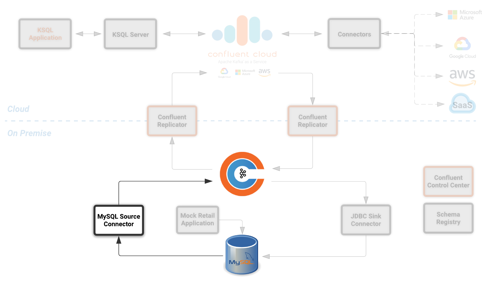

=== Create the MySQL source connector

We have a Kafka Connect worker already up and running in a docker container called `kafka-connect-onprem`. This Kafka Connect worker is configured to connect to your on-premise Kafka cluster and has a internal REST server listening on port `18083`. We can create a connector from the command line using the cURL command. The cURL command allows us to send an HTTP POST request to the REST server, the '-H' option specifies the header of the request and includes the target host and port information, the `-d` option specifies the data we will send, in this case its the configuration options for the connector. You can of course create and manage connectors using any tool or language capable of issuing HTTP requests.

To create the Debezium MySQL Source connector instance run the following command:-

[source,bash,subs="attributes"]
----
curl -i -X POST -H "Accept:application/json" \
  -H  "Content-Type:application/json" http://localhost:18083/connectors/ \
  -d '{
    "name": "mysql-source-connector",
    "config": {
          "connector.class": "io.debezium.connector.mysql.MySqlConnector",
          "database.hostname": "mysql",
          "database.port": "3306",
          "database.user": "mysqluser",
          "database.password": "mysqlpw",
          "database.server.id": "12345",
          "database.server.name": "{dc}",
          "database.whitelist": "orders",
          "table.blacklist": "orders.{dc}_out_of_stock_events",
          "database.history.kafka.bootstrap.servers": "broker:29092",
          "database.history.kafka.topic": "debezium_dbhistory" ,
          "include.schema.changes": "true",
          "snapshot.mode": "when_needed",
          "transforms": "unwrap,sourcedc,TopicRename",
          "transforms.unwrap.type": "io.debezium.transforms.UnwrapFromEnvelope",
          "transforms.sourcedc.type":"org.apache.kafka.connect.transforms.InsertField$Value",
          "transforms.sourcedc.static.field":"sourcedc",
          "transforms.sourcedc.static.value":"{dc}",
          "transforms.TopicRename.type": "org.apache.kafka.connect.transforms.RegexRouter",
          "transforms.TopicRename.regex": "(.*)\\.(.*)\\.(.*)",
          "transforms.TopicRename.replacement": "$1_$3"
      }
  }'
----

The output should resemble something similar to this...

[source,bash]
----
HTTP/1.1 201 Created
Date: Thu, 20 Feb 2020 13:00:57 GMT
Location: http://localhost:18083/connectors/mysql-source-connector
Content-Type: application/json
Content-Length: 1043
Server: Jetty(9.4.20.v20190813)
...
...
----

=== View Messages in Confluent Control Center

Now that the MySQL source connector is up and running, we will be able to see messages appear in our local Kafka cluster. 

We can use link:http://{externalip}:9021[Confluent Control Center, window=_blank] to confirm this. 

Use the following and username and password to authenticate to Confluent Control Center

[source,bash,subs="attributes"]
----
Username: {dc}
Password: your workshop password
----

image::./images/c3_05.png[]

On the landing page we can see that Confluent Control Center is monitoring two Kafka Clusters, our on-premise cluster and a Confluent Cloud Cluster

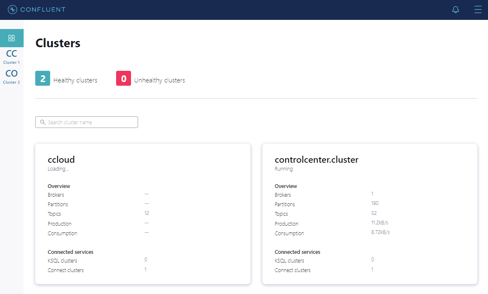

On the left hand navigation bar select "CO" (Controlcenter.cluster), this is your on-premise cluster.

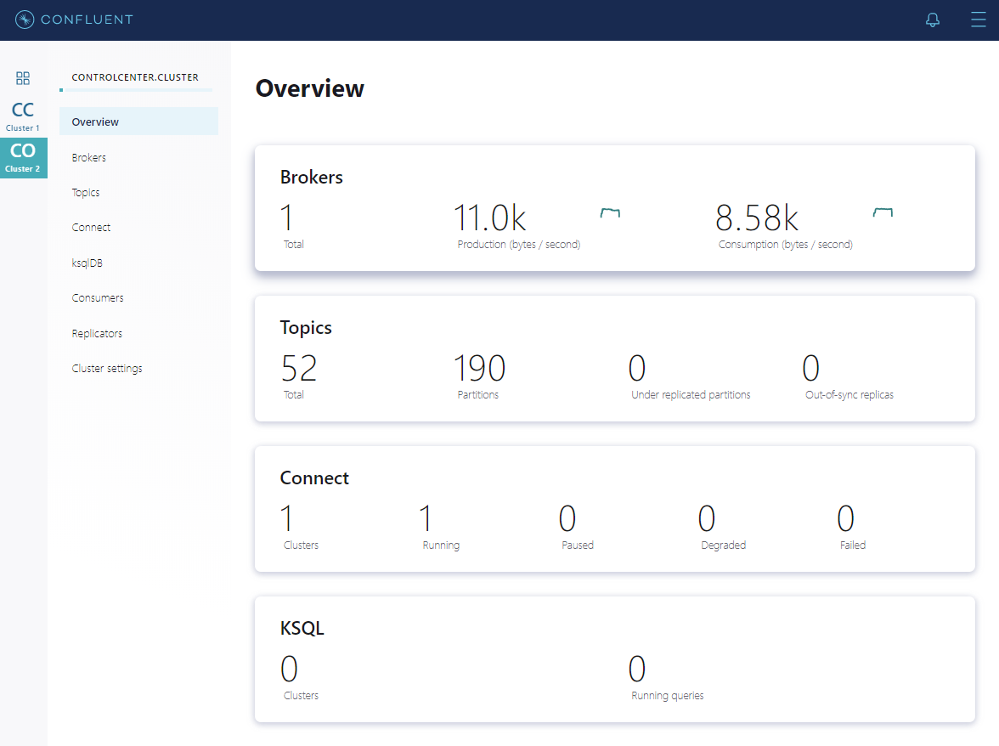

Select the Topics Menu on the left

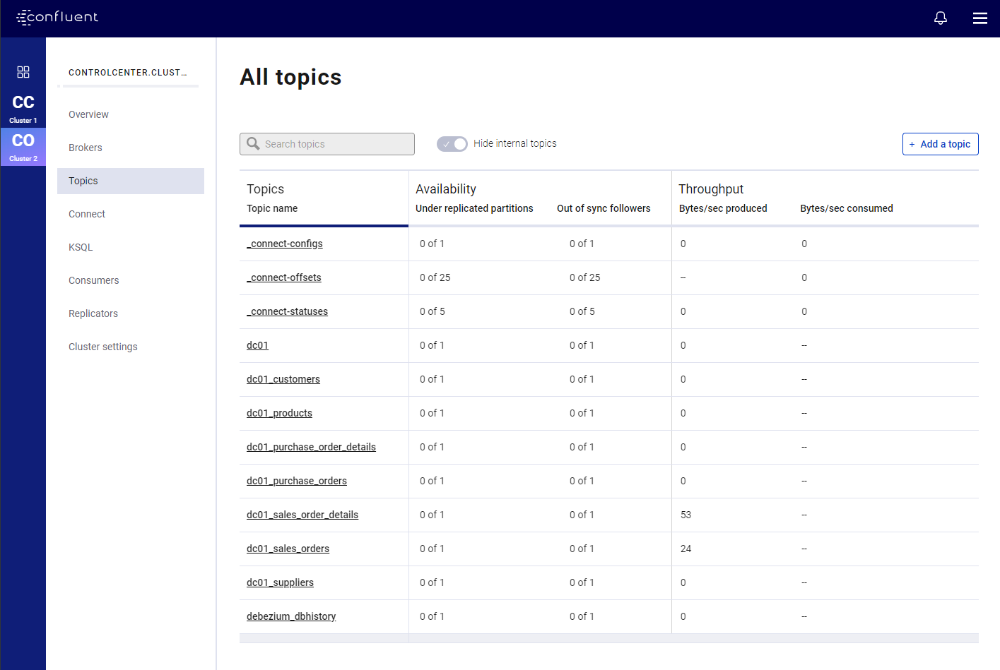

Select the `{dc}_sales_order_details` topic

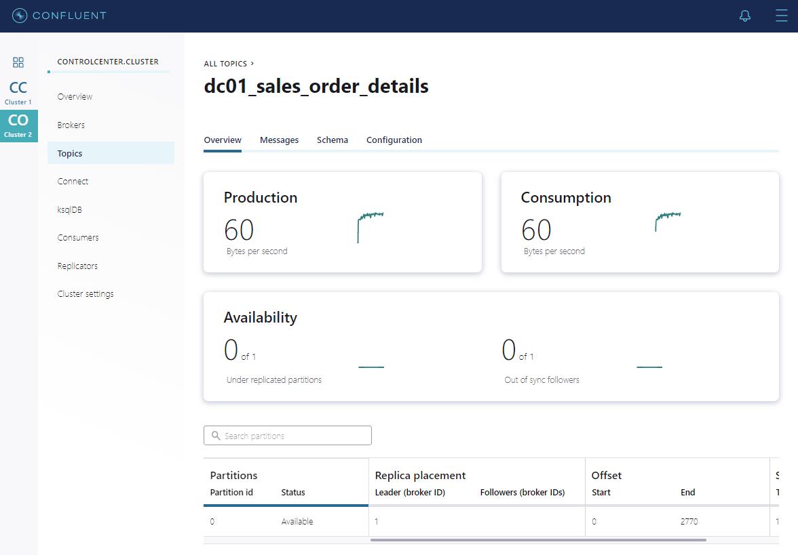

Finally select the Messages tab and observe that messages are being streamed into Kafka from MySQL in real time.

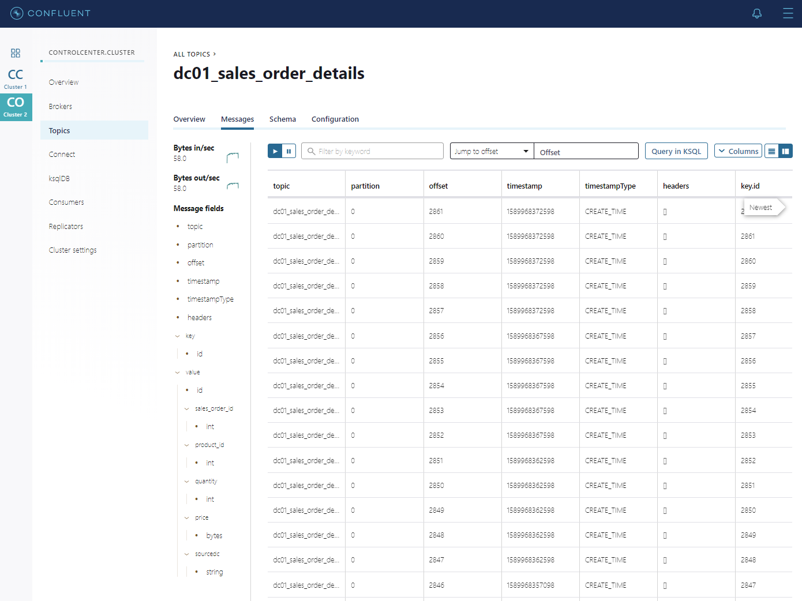

.Further Reading
[TIP]
====
* link:https://debezium.io/documentation/reference/1.1/connectors/mysql.html#mysql-connector-configuration-properties_debezium[Debezium MySQL Configuration Options , window=_blank]
* link:https://docs.confluent.io/current/connect/references/restapi.html[Kafka Connect REST API]
* link:https://curl.haxx.se/docs/manpage.html[cURL manpage]
* link:https://docs.confluent.io/current/control-center/index.html[Confluent Control Center Documentation]
====

== Lab 4: Stream events to Confluent Cloud

Now that your on-premise Kafka cluster is receiving events from your MySQL Database let's use Confluent Replicator to stream those messages to Confluent Cloud

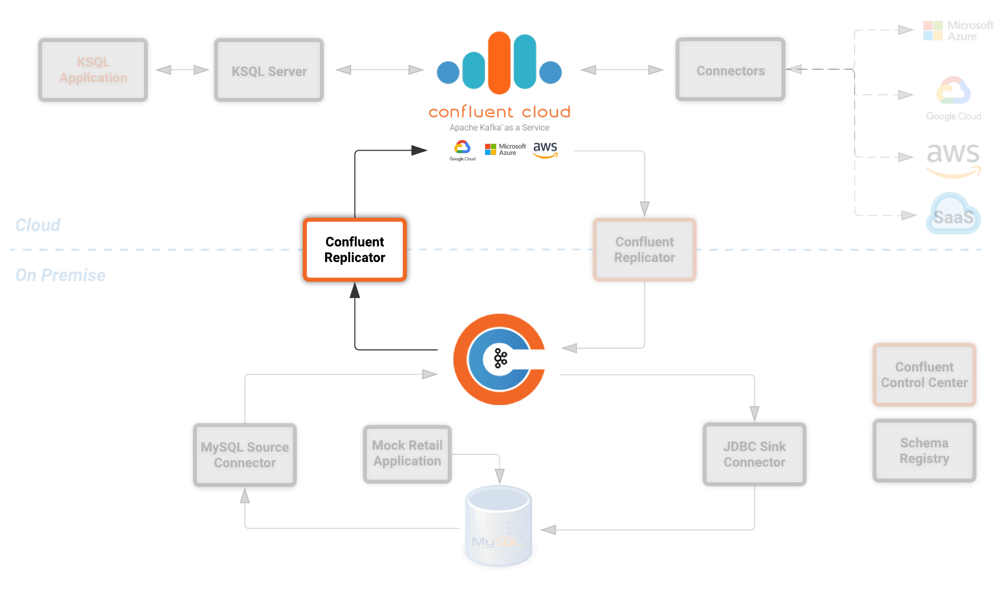

=== Create the Replicator Connector Instance

Confluent Replicator uses Kafka Connect under the covers and can be considered a special type of connector, however, unlike other connectors, the source _and_ target technology for the connector is a Kafka Cluster.

To support this connector, we have another Kafka Connect worker running in a different docker container called `kafka-connect-ccloud`. This Kafka Connect worker is configured to connect to the Confluent Cloud instance provisioned for this workshop. This Kafka Connect worker has an internal REST server listening on port `18084`.

Run the following from the command line to create the Replicator Connector instance, this connector will replicate events from you on-premise Kafka cluster to your Confluent Cloud Cluster.

[source,bash,subs="attributes"]
----
curl -i -X POST -H "Accept:application/json" \
    -H  "Content-Type:application/json" http://localhost:18084/connectors/ \
    -d '{
        "name": "replicator-{dc}-to-ccloud",
        "config": {
          "connector.class": "io.confluent.connect.replicator.ReplicatorSourceConnector",
          "key.converter": "io.confluent.connect.replicator.util.ByteArrayConverter",
          "value.converter": "io.confluent.connect.replicator.util.ByteArrayConverter",
          "topic.config.sync": false,
          "topic.regex": "dc[0-9][0-9][_].*",
          "topic.blacklist": "{dc}_out_of_stock_events",
          "dest.kafka.bootstrap.servers": "${file:/secrets.properties:CCLOUD_CLUSTER_ENDPOINT}",
          "dest.kafka.security.protocol": "SASL_SSL",
          "dest.kafka.sasl.mechanism": "PLAIN",
          "dest.kafka.sasl.jaas.config": "org.apache.kafka.common.security.plain.PlainLoginModule required username=\"${file:/secrets.properties:CCLOUD_API_KEY}\" password=\"${file:/secrets.properties:CCLOUD_API_SECRET}\";",
          "dest.kafka.replication.factor": 3,
          "src.kafka.bootstrap.servers": "broker:29092",
          "src.consumer.group.id": "replicator-{dc}-to-ccloud",
          "src.consumer.interceptor.classes": "io.confluent.monitoring.clients.interceptor.MonitoringConsumerInterceptor",
          "src.consumer.confluent.monitoring.interceptor.bootstrap.servers": "broker:29092",
          "src.kafka.timestamps.producer.interceptor.classes": "io.confluent.monitoring.clients.interceptor.MonitoringProducerInterceptor",
          "src.kafka.timestamps.producer.confluent.monitoring.interceptor.bootstrap.servers": "broker:29092",
          "tasks.max": "1"
        }
    }'
----


You should see something similar...

[source,bash,subs="attributes"]
----
HTTP/1.1 100 Continue

HTTP/1.1 201 Created
Date: Sun, 09 Feb 2020 15:07:22 GMT
Location: http://localhost:18084/connectors/replicator-{dc}-to-ccloud
Content-Type: application/json
Content-Length: 1342
Server: Jetty(9.4.20.v20190813)
...
...
----

=== Confirm that Messages are Arriving in Confluent Cloud

Jump back to link:http://{externalip}:9021[Confluent Control Center, window=_blank]

Select the "CC" cluster from the left-hand navigation bar and then select "Topics". 

This Confluent Cloud Instance is being shared by other users of the workshop and as a result you will see topics being replicated from other data centers. To see just your topics, type your data center name, {dc}, into the search box at the top to filter.

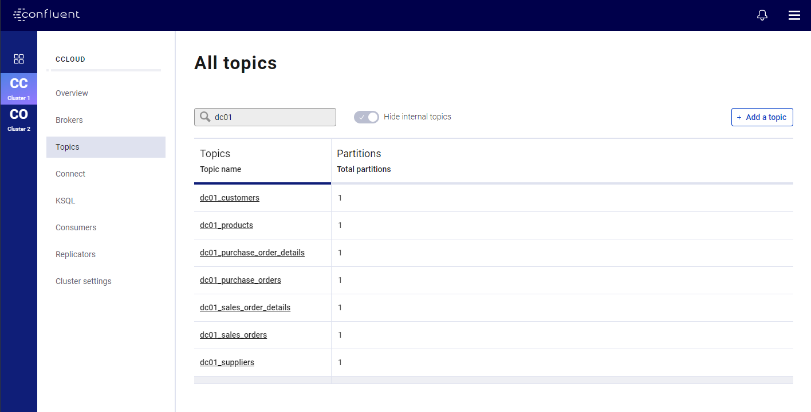

Select the `{dc}_sales_order_details` topic and finally the "Messages" tab under the topic heading. You should see messages streaming in from you on-premise Kafka cluster.

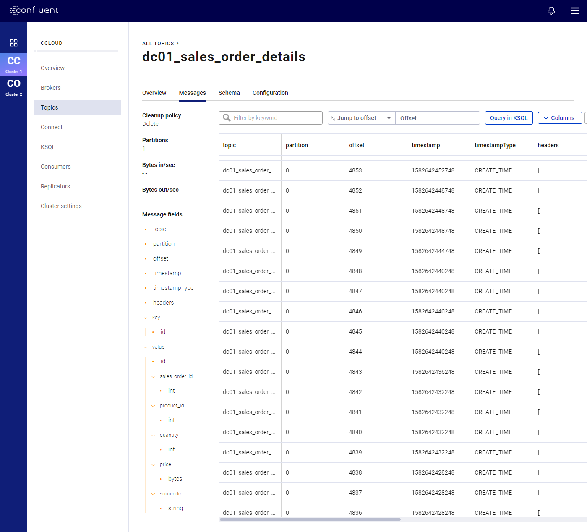

.Further Reading
[TIP]
====
* link:https://docs.confluent.io/current/connect/kafka-connect-replicator/index.html[Confluent Replicator]
* link:https://docs.confluent.io/current/connect/kafka-connect-replicator/configuration_options.html[Confluent Replicator Configuration Properties]
====
== Lab 5: Building a Realtime Supply & Demand Application using KSQL

We now have all the data we need being streamed, in real time, to Confluent Cloud. You have a KSQL Server running inside a docker container that is configured to point to our Confluent Cloud cluster. In a real world deployment, it is likely that this KSQL Server would be running closer to Confluent Cloud but for the purposes of this workshop it is not important.

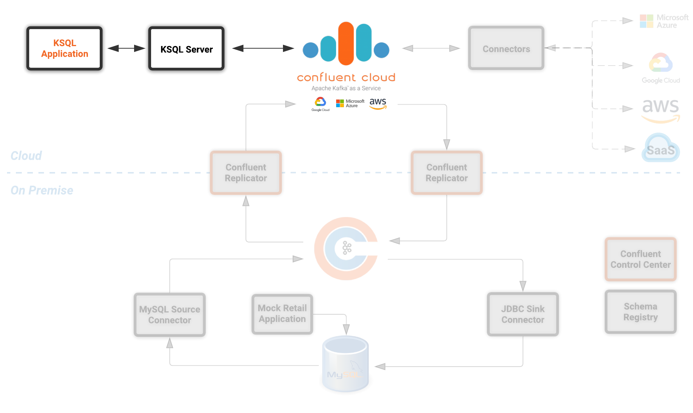

Below is an illustration of the completed Supply & Demand KSQL Application, over the next few labs you will be building this step-by-step.

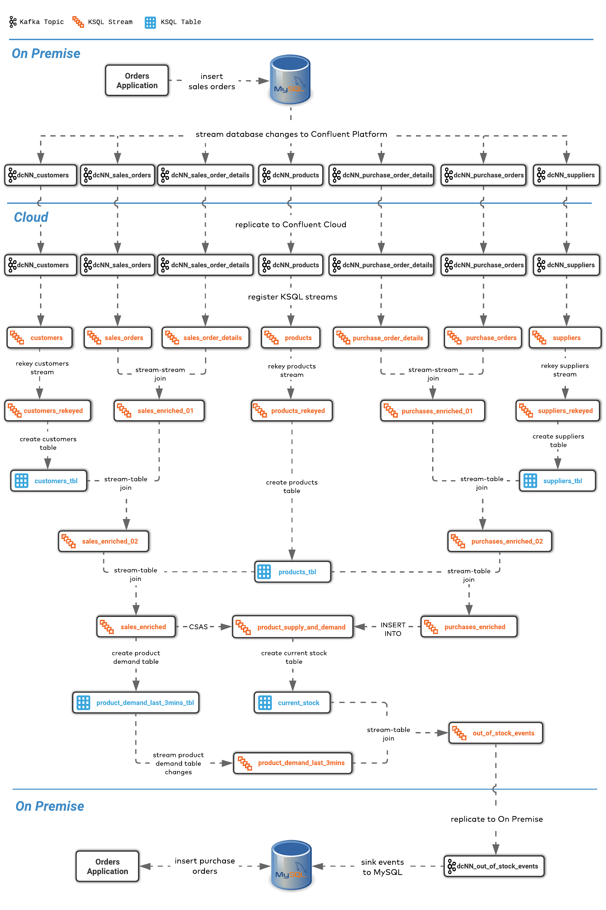

== Lab 6: Getting Started with KSQL

You can interact with KSQL Server using either the https://docs.confluent.io/current/ksql/docs/installation/installing.html#starting-the-ksql-cli[KSQL CLI,window=_blank], https://docs.confluent.io/current/control-center/ksql.html#[Confluent Control Center] or the https://docs.confluent.io/current/ksql/docs/developer-guide/api.html[REST API,window=_blank]. This workshop will focus on the KSQL CLI but if you'd rather use Confluent Control Center then read the next section.

=== Using KSQL with Confluent Control Center

If you’d rather use Confluent Control Center then follow the instructions below, otherwise skip this section.

Open link:http://{externalip}:9021[Confluent Control Center, window=_blank]

Click the "CC" Cluster on the left-hand navigation bar, Select "KSQL" and finally click on the "KSQL" application.

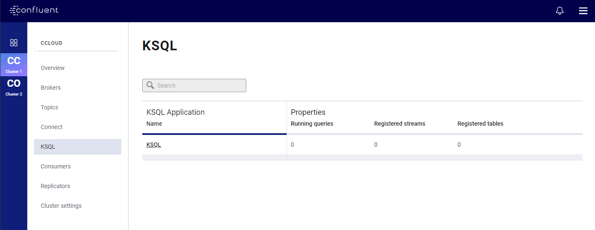

You will now be able to use the "Editor" tab instead of the CLI

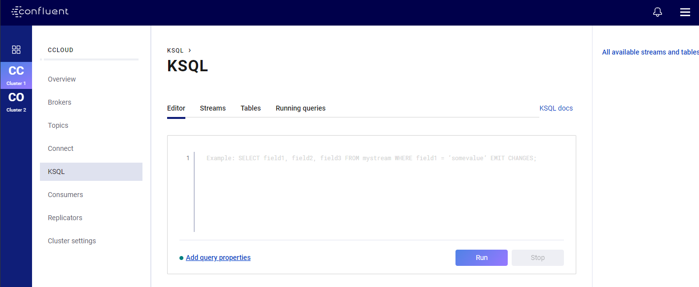

NOTE: **This workshop will focus on the KSQL CLI**

=== Start the KSQL CLI

To start the KSQL CLI run the following command:-

[source,bash,subs="attributes"]
----
docker exec -it ksql-cli ksql http://ksql-server-ccloud:8088
----

You should see something like this:-

```

                  ===========================================
                  =        _  __ _____  ____  _             =
                  =       | |/ // ____|/ __ \| |            =
                  =       | \' /| (___| |  | | |            =
                  =       |  <  \___ \| |  | | |            =
                  =       | . \ ____) | |__| | |____        =
                  =       |_|\_\_____/ \___\_\______|       =
                  =                                         =
                  =  Streaming SQL Engine for Apache Kafka® =
                  ===========================================

Copyright 2017-2019 Confluent Inc.

CLI v5.4.0, Server v5.4.0 located at http://ksql-server-ccloud:8088

Having trouble? Type 'help' (case-insensitive) for a rundown of how things work!

ksql>
```

The KSQL CLI is pointing at a KSQL Server connected to your Confluent Cloud instance.

To view a list of all topics in Confluent Cloud run the following command:-

`show topics;`

You should see your own topics, `{dc}_*`, along with topics from other workshop users.

```
ksql> show topics;

 Kafka Topic                 | Partitions | Partition Replicas
---------------------------------------------------------------
 _confluent-command          | 1          | 3
 _dc01-connect-configs       | 1          | 3
 _dc01-connect-offsets       | 1          | 3
 _dc01-connect-statuses      | 1          | 3
 _dc02-connect-configs       | 1          | 3
 _dc02-connect-offsets       | 1          | 3
 _dc02-connect-statuses      | 1          | 3
 dc01_customers              | 1          | 3
 dc01_products               | 1          | 3
 dc01_purchase_order_details | 1          | 3
 dc01_purchase_orders        | 1          | 3
 dc01_sales_order_details    | 1          | 3
 dc01_sales_orders           | 1          | 3
 dc01_suppliers              | 1          | 3
 dc02_customers              | 1          | 3
 dc02_products               | 1          | 3
 dc02_purchase_order_details | 1          | 3
 dc02_purchase_orders        | 1          | 3
 dc02_sales_order_details    | 1          | 3

...
```

=== Inspect a topic\'s contents

To inspect the contents of a topic run the following:-

`PRINT {dc}_sales_orders;`

You should see something similar:-

[source,json,subs="attributes"]
----
ksql> PRINT {dc}_sales_orders;
Format:AVRO
2/20/20 1:23:55 PM UTC,
�, {"id": 466, "order_date": 1582205036000, "customer_id": 12, "sourcedc": "{dc}"}
2/20/20 1:23:59 PM UTC,
�, {"id": 467, "order_date": 1582205040000, "customer_id": 27, "sourcedc": "{dc}"}
2/20/20 1:24:03 PM UTC,
�, {"id": 468, "order_date": 1582205044000, "customer_id": 20, "sourcedc": "{dc}"}
2/20/20 1:24:07 PM UTC,
�, {"id": 469, "order_date": 1582205048000, "customer_id": 7, "sourcedc": "{dc}"}
2/20/20 1:24:11 PM UTC,
�, {"id": 470, "order_date": 1582205052000, "customer_id": 30, "sourcedc": "{dc}"}
2/20/20 1:24:15 PM UTC,
�, {"id": 471, "order_date": 1582205056000, "customer_id": 27, "sourcedc": "{dc}"}
2/20/20 1:24:20 PM UTC,
�, {"id": 472, "order_date": 1582205060000, "customer_id": 8, "sourcedc": "{dc}"}
2/20/20 1:24:24 PM UTC,
�, {"id": 473, "order_date": 1582205064000, "customer_id": 8, "sourcedc": "{dc}"}
----

Press `ctrl-c` to stop

[TIP]
====
The events streaming from the MySQL database are serialized with Avro and as a result you will see some special characters in the above output, this is because the "PRINT TOPIC" command uses the String deserializer. 
====

=== KSQL Streams

In order to work with a stream of data in KSQL we first need to register a KSQL Stream over an existing topic.

We can do this using a `CREATE STREAM` statement. Run the following command to create your first KSQL stream:-

[source,sql,subs="quotes,attributes"]
----
*CREATE STREAM* sales_orders *WITH* (KAFKA_TOPIC='{dc}_sales_orders', VALUE_FORMAT='AVRO');
----

image::./images/ksql_001.png[align="center"]

You should see the following output

[source,sql,subs="attributes"]
----
ksql> CREATE STREAM sales_orders WITH (KAFKA_TOPIC='{dc}_sales_orders', VALUE_FORMAT='AVRO');

 Message
----------------
 Stream created
----------------
----

Create streams for each of your remaining topics

[source,sql,subs="quotes,attributes"]
----
*CREATE STREAM* sales_order_details *WITH* (KAFKA_TOPIC='{dc}_sales_order_details', VALUE_FORMAT='AVRO');
*CREATE STREAM* purchase_orders *WITH* (KAFKA_TOPIC='{dc}_purchase_orders', VALUE_FORMAT='AVRO');
*CREATE STREAM* purchase_order_details *WITH* (KAFKA_TOPIC='{dc}_purchase_order_details', VALUE_FORMAT='AVRO');
*CREATE STREAM* products *WITH* (KAFKA_TOPIC='{dc}_products', VALUE_FORMAT='AVRO');
*CREATE STREAM* customers *WITH* (KAFKA_TOPIC='{dc}_customers', VALUE_FORMAT='AVRO');
*CREATE STREAM* suppliers *WITH* (KAFKA_TOPIC='{dc}_suppliers', VALUE_FORMAT='AVRO');
----

image::./images/ksql_002.png[align="center"]

To view your current streams run the following command:-

[source,sql,subs="quotes,attributes"]
----
SHOW STREAMS;
----

Notice that each stream is mapped to an underlying Kafka topic and that the format is AVRO. 

[source,sql,subs="attributes"]
----
 Stream Name            | Kafka Topic                 | Format
---------------------------------------------------------------
 CUSTOMERS              | {dc}_customers              | AVRO
 PRODUCTS               | {dc}_products               | AVRO
 PURCHASE_ORDERS        | {dc}_purchase_orders        | AVRO
 PURCHASE_ORDER_DETAILS | {dc}_purchase_order_details | AVRO
 SALES_ORDERS           | {dc}_sales_orders           | AVRO
 SALES_ORDER_DETAILS    | {dc}_sales_order_details    | AVRO
 SUPPLIERS              | {dc}_suppliers              | AVRO
---------------------------------------------------------------
----

To view the details of an individual topic you can you can use the `describe` command:-

[source,sql,subs="quotes,attributes"]
----
*DESCRIBE* sales_order_details;
----

Notice that all the columns have been created for us and we didn't need to explicitly set their names and data types when we created the stream, this is one of the advantages of using AVRO and the Schema Registry.

Also notice that KSQL adds the implicit columns `ROWTIME` and `ROWKEY` to every stream and table, which represent the corresponding Kafka message timestamp and message key, respectively. The timestamp has milliseconds accuracy.

[source,sql,subs="attributes"]
----
Name                 : SALES_ORDER_DETAILS
 Field          | Type
--------------------------------------------
 ROWTIME        | BIGINT           (system)
 ROWKEY         | VARCHAR(STRING)  (system)
 ID             | INTEGER
 SALES_ORDER_ID | INTEGER
 PRODUCT_ID     | INTEGER
 QUANTITY       | INTEGER
 PRICE          | DECIMAL
 SOURCEDC       | VARCHAR(STRING)
--------------------------------------------
For runtime statistics and query details run: DESCRIBE EXTENDED <Stream,Table>;
----

.Further Reading
[TIP]
====
* link:https://docs.confluent.io/current/ksql/docs/index.html[KSQL Overview]
* link:https://docs.confluent.io/current/ksql/docs/developer-guide/create-a-stream.html[KSQL Streams]
* link:https://docs.confluent.io/current/ksql/docs/developer-guide/syntax-reference.html#create-stream[CREATE STREAM Syntax]
====

== Lab 7: Querying Streams using KSQL

There are two types of query in KSQL, *Push* queries and *Pull* queries.

* https://docs.confluent.io/current/ksql/docs/developer-guide/syntax-reference.html#push-query[Push Queries] enable you to subscribe to a result as it changes in real-time. You can subscribe to the output of any query, including those that return a stream or a materialized aggregate table. The `EMIT CHANGES` clause is used to indicate a query is a push query.
* https://docs.confluent.io/current/ksql/docs/developer-guide/syntax-reference.html#pull-query[Pull Queries] are a preview feature with KSQL 5.4 and enable you to look up information at a point in time.

Another important point to understand is where within a topic a query starts to read from. You can control this behaviour using the `ksql.streams.auto.offset.reset` property. This property can either be set to `earliest` where data is consumed from the very beginning of the topic or `latest` where only new data is consumed.

To see the current values for _all_ properties run the following command 
 
[source,bash,subs="quotes,attributes"]
----
SHOW PROPERTIES;
----

Look out for a property called `ksql.streams.auto.offset.reset`, it should currently be set to `earliest`.

[source,bash,subs="attributes"]
----
 Property                                               | Default override | Effective Value                                                                 
--------------------------------------------------------------------------------------------
 ...          
 ksql.streams.auto.offset.reset                         |                  | earliest
 ...                                             
--------------------------------------------------------------------------------------------
ksql>
----

You can override this setting to suit you needs:-

[source,bash,subs="quotes,attributes"]
----
*SET* 'ksql.streams.auto.offset.reset'='earliest';
*SET* 'ksql.streams.auto.offset.reset'='latest';
----

Or preferably, using the abbreviated property names:-

[source,bash,subs="quotes,attributes"]
----
*SET* 'auto.offset.reset' = 'latest';
*SET* 'auto.offset.reset' = 'earliest';
----

Let's start by running a Push query and consume all messages from the beginning of a stream.

[source,sql,subs="quotes,attributes"]
----
*SET* 'auto.offset.reset'='earliest';
*SELECT*  id, 
        sales_order_id, 
        product_id, 
        quantity, 
        price 
*FROM*  sales_order_details 
*EMIT CHANGES*;
----

You should see something similar to this:-
```
ksql> SELECT id, sales_order_id, product_id, quantity, price FROM sales_order_details EMIT CHANGES;
+-----------------+-----------------+-----------------+-----------------+-----------------+
|ID               |SALES_ORDER_ID   |PRODUCT_ID       |QUANTITY         |PRICE            |
+-----------------+-----------------+-----------------+-----------------+-----------------+
|1                |1                |1                |10               |2.68             |
|2                |1                |23               |1                |9.01             |
|3                |1                |14               |6                |5.84             |
|4                |2                |12               |7                |4.00             |
|5                |2                |9                |4                |9.83             |
|6                |2                |5                |1                |8.81             |
|7                |2                |3                |8                |9.99             |
|8                |2                |1                |9                |2.68             |
|9                |3                |21               |5                |9.90             |
|10               |3                |2                |1                |8.23             |
|11               |3                |4                |2                |9.78             |
|12               |4                |15               |2                |6.16             |
...
...
|480              |157              |26               |5                |9.03             |
|481              |158              |2                |2                |8.23             |
|482              |159              |10               |4                |5.32             |
|483              |160              |25               |8                |9.00             |

```
Press `ctrl-c` to stop

Notice that events continue to stream to the console until you explicitly cancel the query, this is because when we are working with streams in KSQL the data set is unbounded and could theoretically continue forever.

To inspect a bounded set of data, you can use the `LIMIT` clause.

[source,sql,subs="quotes,attributes"]
----
*SELECT*  id, 
        sales_order_id, 
        product_id, 
        quantity, 
        price 
*FROM*  sales_order_details 
*EMIT CHANGES*
*LIMIT* 10;
----

Here we are seeing the first 10 messages that were written to the topic. Notice that the query automatically terminates when the limit of 10 events is reached.
[source,sql,subs="attributes"]
----
+-----------------+-----------------+-----------------+-----------------+-----------------+
|ID               |SALES_ORDER_ID   |PRODUCT_ID       |QUANTITY         |PRICE            |
+-----------------+-----------------+-----------------+-----------------+-----------------+
|1                |1                |1                |10               |2.68             |
|2                |1                |23               |1                |9.01             |
|3                |1                |14               |6                |5.84             |
|4                |2                |12               |7                |4.00             |
|5                |2                |9                |4                |9.83             |
|6                |2                |5                |1                |8.81             |
|7                |2                |3                |8                |9.99             |
|8                |2                |1                |9                |2.68             |
|9                |3                |21               |5                |9.90             |
|10               |3                |2                |1                |8.23             |
Limit Reached
Query terminated
ksql>
----

==== Filtering Streams

Since KSQL is based on SQL, you can do many of the standard SQL things you'd expect to be able to do, including predicates and projections. The following query will return a stream of  you the latest sales orders where the `quantity` column is greater than 3.

[source,sql,subs="quotes,attributes"]
----
*SET* 'auto.offset.reset'='latest';
*SELECT*  id, 
        product_id, 
        quantity
*FROM*    sales_order_details
*WHERE*   quantity > 3 
*EMIT CHANGES*;
----

You should only see events where the `quantity` column value is greater than `3`.

[source,sql]
----
+------------------------------+------------------------------+------------------------------+
|ID                            |PRODUCT_ID                    |QUANTITY                      |
+------------------------------+------------------------------+------------------------------+
|3153                          |22                            |8                             |
|3154                          |4                             |6                             |
|3155                          |9                             |4                             |
|3156                          |25                            |10                            |
|3158                          |24                            |8                             |
|3159                          |7                             |4                             |
|3161                          |28                            |8                             |
|3162                          |22                            |7                             |
|3163                          |24                            |6                             |
|3165                          |5                             |8                             |
|3167                          |21                            |9                             |

----

Press `ctrl-c` to stop

.Further Reading
[TIP]
====
* link:https://docs.confluent.io/current/ksql/docs/developer-guide/syntax-reference.html#push-query[Push Query Syntax]
* link:https://docs.confluent.io/current/ksql/docs/developer-guide/syntax-reference.html#pull-query[Pull Query Syntax]
* link:https://docs.confluent.io/current/ksql/docs/installation/server-config/config-reference.html#ksql-streams-auto-offset-reset[KSQL Offset Management]
====

== Lab 8: Creating KSQL tables

KSQL tables allow you to work the data in topics as key/value pairs, with a single value for each key. KSQL tables can be created from an existing topic or from the query results from other tables or streams. You can read more about this https://docs.confluent.io/current/streams/concepts.html#duality-of-streams-and-tables[here].

We want to create tables over the `customers`, `suppliers` and `products` streams so we can look up the current state for each customer, supplier and product. Later in the workshop we will want to join these tables to other streams. To successfully join to a table in KSQL you need to ensure that the table is keyed on the column you are going to use in the join. To achieve this, we need to make sure the stream that we are creating a table from is keyed correctly.

=== Rekeying Streams

We can see what the current key for stream or table is by using the `DESCRIBE EXTENDED` command.

[source,sql,subs="quotes,attributes"]
----
*DESCRIBE EXTENDED* customers;
----

You can see in the output that the `Key Field` is _not_ set.
[source,sql,subs="quotes,attributes"]
----
Name                 : CUSTOMERS
Type                 : STREAM
Key field            :
Key format           : STRING
Timestamp field      : Not set - using <ROWTIME>
Value format         : AVRO
Kafka topic          : {dc}_customers (partitions: 1, replication: 3)

 Field      | Type
----------------------------------------
 ROWTIME    | BIGINT           (system)
 ROWKEY     | VARCHAR(STRING)  (system)
 ID         | INTEGER
 FIRST_NAME | VARCHAR(STRING)
 LAST_NAME  | VARCHAR(STRING)
 EMAIL      | VARCHAR(STRING)
 CITY       | VARCHAR(STRING)
 COUNTRY    | VARCHAR(STRING)
 SOURCEDC   | VARCHAR(STRING)
----------------------------------------
----

We can fix this by creating a derived stream that has the correct key.

[source,sql,subs="quotes,attributes"]
----
*SET* 'auto.offset.reset'='earliest';
*CREATE STREAM* customers_rekeyed *WITH* (KAFKA_TOPIC='{dc}_customers_rekeyed', PARTITIONS=1) *AS*
*SELECT* * *FROM* customers
*PARTITION BY* id;
----

image::./images/ksql_003.png[align="center"]

This method of creating a derived topic is frequently referred to by the acronym `CSAS` -> `CREATE STREAM … AS SELECT` where we create a new topic based on the contents of another. Unlike CSAS statements in a traditional RDBMS, CSAS statments in KSQL create _continuous queries_ where data is continuosly streamed from the source topic into the target topic.

We can confirm that the new stream has the correct key by running the `DESCRIBE EXTENDED` command again

[source,sql,subs="quotes,attributes"]
----
*DESCRIBE EXTENDED* customers_rekeyed;
----

You can see in the output that the `Key Field` is now set correctly. 

[source,sql,subs="quotes,attributes"]
----
Name                 : CUSTOMERS_REKEYED
Type                 : STREAM
Key field            : CUSTOMERS_REKEYED.ID
Key format           : STRING
Timestamp field      : Not set - using <ROWTIME>
Value format         : AVRO
Kafka topic          : {dc}_customers_rekeyed (partitions: 1, replication: 3)

 Field      | Type
----------------------------------------
 ROWTIME    | BIGINT           (system)
 ROWKEY     | VARCHAR(STRING)  (system)
 ID         | INTEGER          (key)
 FIRST_NAME | VARCHAR(STRING)
 LAST_NAME  | VARCHAR(STRING)
 EMAIL      | VARCHAR(STRING)
 CITY       | VARCHAR(STRING)
 COUNTRY    | VARCHAR(STRING)
 SOURCEDC   | VARCHAR(STRING)
----------------------------------------

Queries that write from this STREAM
-----------------------------------
CSAS_CUSTOMERS_REKEYED_10 : CREATE STREAM CUSTOMERS_REKEYED WITH (KAFKA_TOPIC='{dc}_customers_rekeyed', PARTITIONS=1, REPLICAS=3) AS SELECT *
FROM CUSTOMERS CUSTOMERS
EMIT CHANGES
PARTITION BY ID;

For query topology and execution plan please run: EXPLAIN <QueryId>

Local runtime statistics
------------------------
messages-per-sec:      0.30   total-messages:        30     last-message: 2020-02-26T12:11:31.227Z

(Statistics of the local KSQL server interaction with the Kafka topic {dc}_customers_rekeyed)
----

In the above output also notice the `Queries that write from this STREAM` section, here you can see the query you just ran, this a called a persistant query and runs in the background continuously streaming messages until it is terminated. 

You can view the current persistant queries that are running using the following command:-

[source,sql,subs="quotes,attributes"]
----
SHOW QUERIES;
----

[source,sql,subs="quotes,attributes"]
----
 Query ID                  | Kafka Topic       | Query String                                                 
--------------------------------------------------------------------------------------------------------------
 CSAS_CUSTOMERS_REKEYED_10 | CUSTOMERS_REKEYED | CREATE STREAM CUSTOMERS_REKEYED WITH (KAFKA_TOPIC='{dc}_customers_rekeyed', PARTITIONS=1, REPLICAS=3) AS SELECT *
FROM CUSTOMERS CUSTOMERS
EMIT CHANGES
PARTITION BY ID;
--------------------------------------------------------------------------------------------------------------
For detailed information on a Query run: EXPLAIN <Query ID>;
----

Now that we have our `customers_rekeyed` stream created let's rekey the `supplier` and `products` streams.

[source,sql,subs="quotes,attributes"]
----
*SET* 'auto.offset.reset'='earliest';
*CREATE STREAM* products_rekeyed *WITH* (KAFKA_TOPIC='{dc}_products_rekeyed', PARTITIONS=1) *AS*
*SELECT* * *FROM* products
*PARTITION BY* id;

*CREATE STREAM* suppliers_rekeyed *WITH* (KAFKA_TOPIC='{dc}_suppliers_rekeyed', PARTITIONS=1) *AS*
*SELECT* * *FROM* suppliers
*PARTITION BY* id;
----

image::./images/ksql_004.png[align="center"]

Another way to confirm a stream is keyed correctly, is to query it and compare the system `ROWKEY` column to your join column, they should be identical.

[source,sql,subs="quotes,attributes"]
----
*SELECT* rowkey, id *FROM* customers_rekeyed *EMIT CHANGES LIMIT* 3;
*SELECT* rowkey, id *FROM* products_rekeyed *EMIT CHANGES LIMIT* 3;
*SELECT* rowkey, id *FROM* suppliers_rekeyed *EMIT CHANGES LIMIT* 3;
----

You can see in the output that the `ROWKEY` and `ID` columns have identical values for each stream.

[source,sql,subs="quotes,attributes"]
----
ksql> SELECT rowkey, id FROM customers_rekeyed EMIT CHANGES LIMIT 3;
+-------------------------------------------+-------------------------------------------+
|ROWKEY                                     |ID                                         |
+-------------------------------------------+-------------------------------------------+
|1                                          |1                                          |
|2                                          |2                                          |
|3                                          |3                                          |
Limit Reached
Query terminated
----
[source,sql,subs="quotes,attributes"]
----
ksql> SELECT rowkey, id FROM suppliers_rekeyed EMIT CHANGES LIMIT 3;
+-------------------------------------------+-------------------------------------------+
|ROWKEY                                     |ID                                         |
+-------------------------------------------+-------------------------------------------+
|1                                          |1                                          |
|2                                          |2                                          |
|3                                          |3                                          |
Limit Reached
Query terminated
----
[source,sql,subs="quotes,attributes"]
----
ksql> SELECT rowkey, id FROM products_rekeyed EMIT CHANGES LIMIT 3;
+-------------------------------------------+-------------------------------------------+
|ROWKEY                                     |ID                                         |
+-------------------------------------------+-------------------------------------------+
|1                                          |1                                          |
|2                                          |2                                          |
|3                                          |3                                          |
Limit Reached
Query terminated
----

=== Creating Tables

We are now in a position where we can create our first KSQL tables. To do this we need to register tables with KSQL over the newly re-keyed topics. 

[source,sql,subs="quotes,attributes"]
----
*CREATE TABLE* customers_tbl *WITH* (KAFKA_TOPIC='{dc}_customers_rekeyed', VALUE_FORMAT='AVRO', key='id');
*CREATE TABLE* products_tbl *WITH* (KAFKA_TOPIC='{dc}_products_rekeyed', VALUE_FORMAT='AVRO', key='id');
*CREATE TABLE* suppliers_tbl *WITH* (KAFKA_TOPIC='{dc}_suppliers_rekeyed', VALUE_FORMAT='AVRO', key='id');
----

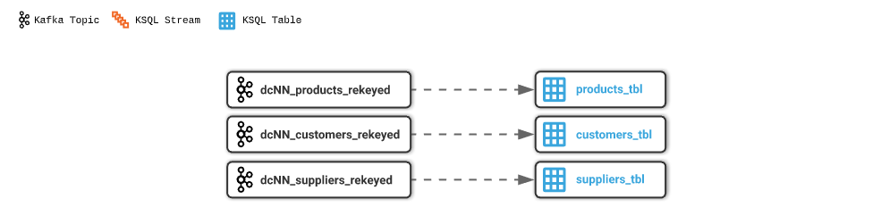

We can view our current tables using the following command:-

[source,sql,subs="attributes"]
----
SHOW TABLES;
----

[source,sql,subs="attributes"]
----
 Table Name    | Kafka Topic            | Format | Windowed
------------------------------------------------------------
 CUSTOMERS_TBL | {dc}_customers_rekeyed | AVRO   | false
 PRODUCTS_TBL  | {dc}_products_rekeyed  | AVRO   | false
 SUPPLIERS_TBL | {dc}_suppliers_rekeyed | AVRO   | false
------------------------------------------------------------
----

We'll use these tables soon and join them to our streams.

.Further Reading
[TIP]
====
* link:https://docs.confluent.io/current/ksql/docs/developer-guide/syntax-reference.html#create-table[CREATE TABLE Syntax]
* link:https://docs.confluent.io/current/ksql/docs/developer-guide/syntax-reference.html#describe[DESCRIBE Syntax]
* link:https://docs.confluent.io/current/ksql/docs/developer-guide/syntax-reference.html#create-stream-as-select[CREATE STREAM AS SELECT Syntax]
* link:https://docs.confluent.io/current/ksql/docs/developer-guide/syntax-reference.html#key-requirements[Message Key Requirements]
====

== Lab 9: KSQL Stream-to-Stream Joins

We can join two streams together in KSQL using a windowed join. When using a windowed join, you must specify a windowing scheme by using the `WITHIN` clause. A new input record on one side produces a join output for each matching record on the other side, and there can be multiple such matching records within a join window.

In the example below you can see that we have specified a window of 1 seconds using the `WITHIN` clause. The source application creates sales orders and their associated sales order detail rows at the same time, so a second will be plenty of time to ensure that a join takes place.

[source,sql,subs="quotes,attributes"]
----
*CREATE STREAM* sales_enriched_01 *WITH* (PARTITIONS = 1, KAFKA_TOPIC = '{dc}_sales_enriched_01') *AS SELECT*
    o.id order_id,
    od.id order_details_id,
    o.order_date,
    o.customer_id,
    od.product_id,
    od.quantity,
    od.price
*FROM* sales_orders o
*INNER JOIN* sales_order_details od *WITHIN* 1 SECONDS *ON* (o.id = od.sales_order_id);
----

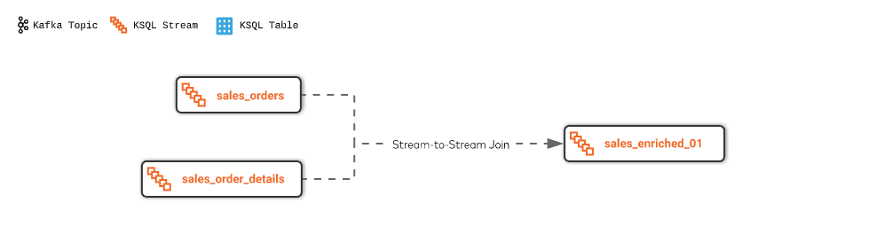

If we query this new stream... 

[source,sql,subs="quotes,attributes"]
----
*SELECT*  order_id o_id,
        order_details_id od_id,
        timestamptostring(order_date,'dd-MM-YY') order_date,
        customer_id,
        product_id,
        quantity,
        price
*FROM*  sales_enriched_01 
*EMIT CHANGES* 
*LIMIT* 10;
----

...we can see that we have combined the data from both the `sales_order` and `sales_order_details` streams.

[source,sql,subs="quotes,attributes"]
----
+-----------+-----------+-----------+-----------+-----------+-----------+-----------+
|O_ID       |OD_ID      |ORDER_DATE |CUSTOMER_ID|PRODUCT_ID |QUANTITY   |PRICE      |
+-----------+-----------+-----------+-----------+-----------+-----------+-----------+
|1          |1          |28-02-20   |23         |21         |2          |9.90       |
|1          |2          |28-02-20   |23         |14         |10         |5.84       |
|1          |3          |28-02-20   |23         |9          |10         |9.83       |
|2          |4          |28-02-20   |20         |19         |3          |3.38       |
|2          |5          |28-02-20   |20         |12         |6          |4.00       |
|2          |6          |28-02-20   |20         |6          |6          |8.24       |
|2          |7          |28-02-20   |20         |15         |5          |6.16       |
|2          |8          |28-02-20   |20         |22         |10         |8.19       |
|3          |9          |28-02-20   |9          |11         |3          |4.65       |
|4          |10         |28-02-20   |12         |20         |6          |4.86       |
Limit Reached
Query terminated

----

.Further Reading
[TIP]
====
* link:https://docs.confluent.io/current/ksql/docs/developer-guide/join-streams-and-tables.html#stream-stream-joins[Stream-Stream Joins]
====

== Lab 10: KSQL Stream-to-Table Joins

We can take this a step further by joining this new stream to a couple of the KSQL tables we created earlier. 

To do this we'll need to create a new stream, `sales_enriched_02`, that'll stream the result of joining the `sales_enriched_01` stream to the `customers_tbl` table.

[source,sql,subs="quotes,attributes"]
----

*CREATE STREAM* sales_enriched_02 *WITH* (PARTITIONS = 1, KAFKA_TOPIC = '{dc}_sales_enriched_02') *AS SELECT*
    se.order_id,
    se.order_details_id,
    se.order_date,
    se.customer_id,
    se.product_id,
    se.quantity,
    se.price,
    ct.first_name,
    ct.last_name,
    ct.email,
    ct.city,
    ct.country 
*FROM* sales_enriched_01 se
*INNER JOIN* customers_tbl ct *ON* (se.customer_id = ct.id);
----

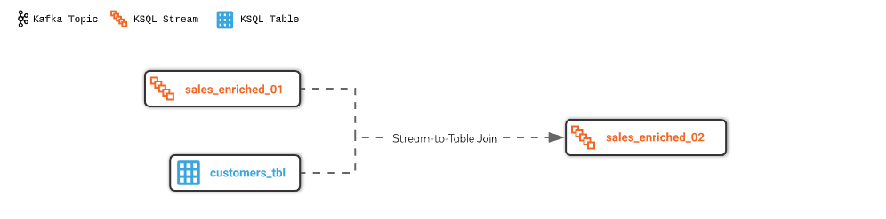

And last but not least we can join to our products table by creating our final stream `sales_enriched` which will be the result of joining the `sales_enriched_02` stream to the `products_tbl` table.

[source,sql,subs="quotes,attributes"]
----
*CREATE STREAM* sales_enriched *WITH* (PARTITIONS = 1, KAFKA_TOPIC = '{dc}_sales_enriched') *AS SELECT*
    se.order_id,
    se.order_details_id,
    se.order_date,
    se.product_id product_id,
    pt.name product_name, 
    pt.description product_desc,
    se.price product_price,
    se.quantity product_qty,
    se.customer_id customer_id,
    se.first_name customer_fname,
    se.last_name customer_lname,
    se.email customer_email,
    se.city customer_city,
    se.country customer_country
*FROM* sales_enriched_02 se
*INNER JOIN* products_tbl pt *ON* (se.product_id = pt.id);
----

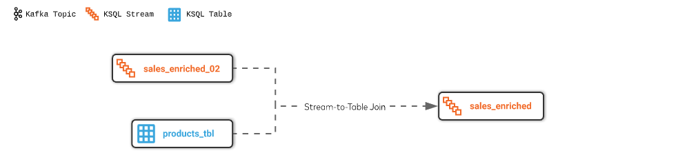

If we run a describe on this stream... 

[source,sql,subs="quotes,attributes"]
----
*DESCRIBE* sales_enriched;
----

...you'll see that we have effectively denormalized the `sales_orders`, `sales_order_details`, `customers` and `products` streams/tables into a single event stream.

[source,sql,subs="quotes,attributes"]
----
 Field            | Type
----------------------------------------------
 ROWTIME          | BIGINT           (system)
 ROWKEY           | VARCHAR(STRING)  (system)
 ORDER_ID         | INTEGER
 ORDER_DETAILS_ID | INTEGER
 ORDER_DATE       | BIGINT
 PRODUCT_ID       | INTEGER
 PRODUCT_NAME     | VARCHAR(STRING)
 PRODUCT_DESC     | VARCHAR(STRING)
 PRODUCT_PRICE    | DECIMAL
 PRODUCT_QTY      | INTEGER
 CUSTOMER_ID      | INTEGER
 CUSTOMER_FNAME   | VARCHAR(STRING)
 CUSTOMER_LNAME   | VARCHAR(STRING)
 CUSTOMER_EMAIL   | VARCHAR(STRING)
 CUSTOMER_CITY    | VARCHAR(STRING)
 CUSTOMER_COUNTRY | VARCHAR(STRING)
----------------------------------------------
----


We now need to create an equivilent `purchases_enriched` stream that combines the `purchase_orders`, `purchase_order_details`, `suppliers` and `products` streams/tables. Since the purchases data model is very similar to that of the sales data model the process is the same.

Join the `purchase_orders` stream to the `purchase_order_details` stream

[source,sql,subs="quotes,attributes"]
----
*CREATE STREAM* purchases_enriched_01 *WITH* (PARTITIONS = 1, KAFKA_TOPIC = '{dc}_purchases_enriched_01') *AS SELECT*
    o.id order_id,
    od.id order_details_id,
    o.order_date,
    o.supplier_id,
    od.product_id,
    od.quantity,
    od.cost
*FROM* purchase_orders o
*INNER JOIN* purchase_order_details od *WITHIN* 1 SECONDS *ON* (o.id = od.purchase_order_id);
----

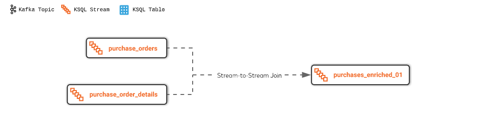

If we query this new stream... 

[source,sql,subs="quotes,attributes"]
----
*SELECT*  order_id o_id,
        order_details_id od_id,
        timestamptostring(order_date,'dd-MM-YY') order_date,
        supplier_id,
        product_id,
        quantity,
        cost
*FROM*  purchases_enriched_01 
*EMIT CHANGES* 
*LIMIT* 10;
----

...we can see that we have combined the data from both the `purchase_order` and `purchase_order_details` streams.

[source,sql,subs="quotes,attributes"]
----
+------------+------------+------------+------------+------------+------------+------------+
|O_ID        |OD_ID       |ORDER_DATE  |SUPPLIER_ID |PRODUCT_ID  |QUANTITY    |COST        |
+------------+------------+------------+------------+------------+------------+------------+
|1           |1           |02-03-20    |1           |1           |100         |6.82        |
|1           |2           |02-03-20    |1           |2           |100         |7.52        |
|1           |3           |02-03-20    |1           |3           |100         |6.16        |
|1           |4           |02-03-20    |1           |4           |100         |8.07        |
|1           |5           |02-03-20    |1           |5           |100         |2.10        |
|1           |6           |02-03-20    |1           |6           |100         |7.45        |
|1           |7           |02-03-20    |1           |7           |100         |4.02        |
|1           |8           |02-03-20    |1           |8           |100         |0.64        |
|1           |9           |02-03-20    |1           |9           |100         |8.51        |
|1           |10          |02-03-20    |1           |10          |100         |3.61        |
Limit Reached
Query terminated
----

Join the `purchases_enriched_01` stream to the `suppliers_tbl` table...

[source,sql,subs="quotes,attributes"]
----
*CREATE STREAM* purchases_enriched_02 *WITH* (PARTITIONS = 1, KAFKA_TOPIC = '{dc}_purchases_enriched_02') *AS SELECT*
    pe.order_id,
    pe.order_details_id,
    pe.order_date,
    pe.supplier_id,
    pe.product_id,
    pe.quantity,
    pe.cost,
    st.name,
    st.email,
    st.city,
    st.country 
*FROM* purchases_enriched_01 pe
*INNER JOIN* suppliers_tbl st *ON* (pe.supplier_id = st.id);
----

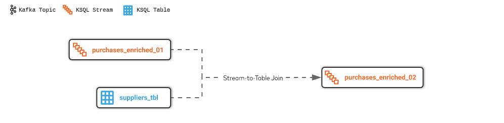

...and finally join to the `products_tbl` table

[source,sql,subs="quotes,attributes"]
----
*CREATE STREAM* purchases_enriched *WITH* (PARTITIONS = 1, KAFKA_TOPIC = '{dc}_purchases_enriched') *AS SELECT*
    pe.order_id,
    pe.order_details_id,
    pe.order_date,
    pe.product_id product_id,
    pt.name product_name, 
    pt.description product_desc,
    pe.cost product_cost,
    pe.quantity product_qty,
    pe.supplier_id supplier_id,
    pe.name supplier_name,
    pe.email supplier_email,
    pe.city supplier_city,
    pe.country supplier_country
*FROM* purchases_enriched_02 pe
*INNER JOIN* products_tbl pt *ON* (pe.product_id = pt.id);
----

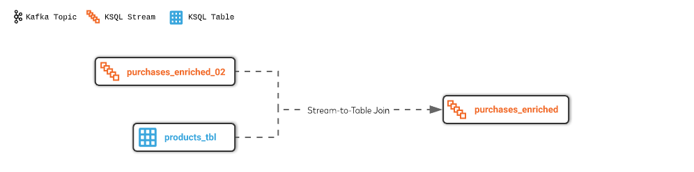

If we run a describe on this stream...

[source,sql,subs="quotes,attributes"]
----
*DESCRIBE* purchases_enriched;
----

[source,sql,subs="quotes,attributes"]
----
Name                 : PURCHASES_ENRICHED
 Field            | Type
----------------------------------------------
 ROWTIME          | BIGINT           (system)
 ROWKEY           | VARCHAR(STRING)  (system)
 ORDER_ID         | INTEGER
 ORDER_DETAILS_ID | INTEGER
 ORDER_DATE       | BIGINT
 PRODUCT_ID       | INTEGER
 PRODUCT_NAME     | VARCHAR(STRING)
 PRODUCT_DESC     | VARCHAR(STRING)
 PRODUCT_COST     | DECIMAL
 PRODUCT_QTY      | INTEGER
 SUPPLIER_ID      | INTEGER
 SUPPLIER_NAME    | VARCHAR(STRING)
 SUPPLIER_EMAIL   | VARCHAR(STRING)
 SUPPLIER_CITY    | VARCHAR(STRING)
 SUPPLIER_COUNTRY | VARCHAR(STRING)
----------------------------------------------
----

...you'll see that we have also denormalized the `purchase_orders`, `purchase_order_details`, `suppliers` and `products` streams/tables into a single event stream.

Let's query the `purchases_enriched` stream from the very beginning

[source,sql,subs="quotes,attributes"]
----
*SET* 'auto.offset.reset'='earliest';
*SELECT* product_id, 
       product_name, 
       product_qty 
*FROM* purchases_enriched 
*EMIT CHANGES*;
----

Notice that the query returns the first 30 purchase order lines and then stops; this is because no purchase orders are being created by our orders application. The orders application will raise purchase orders for us when we send it some out of stock events.

[source,bash,subs="quotes,attributes"]
----
+-------------------------+----------------------------------+------------------------+
|PRODUCT_ID               |PRODUCT_NAME                      |PRODUCT_QTY             |
+-------------------------+----------------------------------+------------------------+
|1                        |Yogurt - Assorted Pack            |100                     |
|2                        |Ostrich - Fan Fillet              |100                     |
|3                        |Fish - Halibut, Cold Smoked       |100                     |
|4                        |Tomatoes Tear Drop Yellow         |100                     |
|5                        |Pasta - Fettuccine, Egg, Fresh    |100                     |
|6                        |Plastic Wrap                      |100                     |
|7                        |Pineapple - Regular               |100                     |
|8                        |Quail - Eggs, Fresh               |100                     |
|9                        |Pork - Ground                     |100                     |
|10                       |Lamb Shoulder Boneless Nz         |100                     |
|11                       |Sausage - Meat                    |100                     |
|12                       |Herb Du Provence - Primerba       |100                     |
|13                       |Bread - Kimel Stick Poly          |100                     |
|14                       |Food Colouring - Red              |100                     |
|15                       |Cheese - Grie Des Champ           |100                     |
|16                       |Longos - Lasagna Veg              |100                     |
|17                       |Beets - Golden                    |100                     |
|18                       |Bread - Dark Rye                  |100                     |
|19                       |Pepperoni Slices                  |100                     |
|20                       |Glass - Wine, Plastic, Clear 5 Oz |100                     |
|21                       |Soup - Campbells, Beef Barley     |100                     |
|22                       |Bread - Kimel Stick Poly          |100                     |
|23                       |Plate - Foam, Bread And Butter    |100                     |
|24                       |Parsley - Fresh                   |100                     |
|25                       |Cookie - Oreo 100x2               |100                     |
|26                       |Bread - Crusty Italian Poly       |100                     |
|27                       |Wine - Chateauneuf Du Pape        |100                     |
|28                       |Country Roll                      |100                     |
|29                       |Wine - Redchard Merritt           |100                     |
|30                       |Doilies - 5, Paper                |100                     |
----

.Further Reading
[TIP]
====
* link:https://docs.confluent.io/current/ksql/docs/developer-guide/join-streams-and-tables.html#stream-table-joins[Stream-Table Joins]
====

== Lab 11: Streaming Stock Levels
Before we can create an out of stock event stream, we need to work out the current stock levels for each product. We can do this by combining the `sales_enriched` stream with the `purchases_enriched` stream and summing the `sales_enriched.quantity` column (stock decrements) and the `purchases_enriched.quantity` column (stock increments).

Let's have a go at this now by creating a new stream called `product_supply_and_demand`. This stream is consuming messages from the `sales_enriched` stream and included the `product_id` and `quantity` column converted to a negative value, we do this because sales events are our _demand_ and hence decrement stock.

[source,sql,subs="quotes,attributes"]
----
*SET* 'auto.offset.reset'='earliest';
*CREATE STREAM* product_supply_and_demand *WITH* (PARTITIONS=1, KAFKA_TOPIC='{dc}_product_supply_and_demand') *AS SELECT* 
  product_id, 
  product_qty * -1 "QUANTITY" 
*FROM* sales_enriched;
----

image::./images/ksql_012.png[align="center"]

Let's have a quick look at the first few rows of this stream

[source,sql,subs="quotes,attributes"]
----
*SET* 'auto.offset.reset'='earliest';
*SELECT*  product_id, 
        quantity 
*FROM*    product_supply_and_demand 
*EMIT CHANGES* 
*LIMIT* 20;
----

This query shows a history of all sales and their affect on stock levels. 

[source,sql,subs="quotes,attributes"]
----
+------------------------------------------+------------------------------------------+
|PRODUCT_ID                                |QUANTITY                                  |
+------------------------------------------+------------------------------------------+
|1                                         |-6                                        |
|15                                        |-3                                        |
|14                                        |-7                                        |
|23                                        |-3                                        |
|13                                        |-10                                       |
|4                                         |-9                                        |
|10                                        |-9                                        |
|15                                        |-8                                        |
|10                                        |-2                                        |
|27                                        |-7                                        |
|6                                         |-2                                        |
|5                                         |-6                                        |
|25                                        |-8                                        |
|24                                        |-1                                        |
|2                                         |-8                                        |
|26                                        |-10                                       |
|13                                        |-9                                        |
|16                                        |-9                                        |
|28                                        |-8                                        |
|4                                         |-9                                        |
Limit Reached
Query terminated
----

What we need to do now is also include all product purchases in the same stream. We can do this using an `INSERT INTO` statement. The `INSERT INTO` statement streams the result of a SELECT query into an existing stream and its underlying topic.

[source,sql,subs="quotes,attributes"]
----
*INSERT INTO* product_supply_and_demand 
  *SELECT*  product_id, 
          product_qty "QUANTITY" 
  *FROM*    purchases_enriched;
----

image::./images/ksql_013.png[align="center"]

Our `product_supply_and_demand` now includes all product sales as stock decrements and all product purchases as stock increments.

We can see the demand for a single product by filtering on the `product_id` and including only events where the `quantity` is less than zero.

[source,sql,subs="quotes,attributes"]
----
*SET* 'auto.offset.reset'='earliest';
*SELECT*  product_id, 
        quantity 
*FROM*    product_supply_and_demand 
*WHERE* product_id = 15
*AND*   quantity < 0
*EMIT CHANGES*;
----

[source,sql,subs="quotes,attributes"]
----
+------------------------------------------+------------------------------------------+
|PRODUCT_ID                                |QUANTITY                                  |
+------------------------------------------+------------------------------------------+
|1                                         |-6                                        |
|1                                         |-9                                        |
|1                                         |-7                                        |
|1                                         |-5                                        |
|1                                         |-1                                        |
|1                                         |-7                                        |
|1                                         |-7                                        |
|1                                         |-10                                       |
|1                                         |-8                                        |
|1                                         |-4                                        |
|1                                         |-2                                        |
...
...
...
----

We can also see the supply for a single product by filtering on the `product_id` and including only events where the `quantity` is greater than zero.

[source,sql,subs="quotes,attributes"]
----
*SET* 'auto.offset.reset'='earliest';
*SELECT*  product_id, 
        quantity 
*FROM*    product_supply_and_demand 
*WHERE* product_id = 15
*AND*   quantity > 0
*EMIT CHANGES*;
----

This query will only return a single event and reflects the initial purchase order line that was raised for this product.

[source,sql,subs="quotes,attributes"]
----
+------------------------------------------+------------------------------------------+
|PRODUCT_ID                                |QUANTITY                                  |
+------------------------------------------+------------------------------------------+
|1                                         |100                                       |
----

We're now is a position where we can calculate the current stock level for each product. We can do this by creating a table that groups by the `product_id` and sums up the `quantity` column which contains both stock decrements and stock increments.

[source,sql,subs="quotes,attributes"]
----
*SET* 'auto.offset.reset'='earliest';
*CREATE TABLE* current_stock *WITH* (PARTITIONS = 1, KAFKA_TOPIC = '{dc}_current_stock') *AS SELECT* 
      product_id
    , SUM(quantity) "STOCK_LEVEL" 
*FROM* product_supply_and_demand
*GROUP BY* product_id;
----

image::./images/ksql_014.png[align="center"]

When we query this table with a Push query... 

[source,sql,subs="quotes,attributes"]
----
*SET* 'auto.offset.reset'='latest';
*SELECT*  product_id,
        stock_level
*FROM*  current_stock
*EMIT CHANGES*;
----

...each new event that is displayed on the console reflects the current stock level for the associated product, a new event will be emitted  each time a product's stock level changes. 
Depending on how long it took you to get to this point in the workshop, you may see that all your stock levels are negative. This is because, apart from the initial purchase order for 100 of each product, we have not created any more purchase orders and our customers will have their orders on hold until we acquire more stock, not good, but we'll fix that soon.

.Further Reading
[TIP]
====
* link:https://docs.confluent.io/current/ksql/docs/developer-guide/syntax-reference.html#insert-into[INSERT INTO Syntax]
* link:https://docs.confluent.io/current/ksql/docs/developer-guide/syntax-reference.html#create-table-as-select[CREATE TABLE AS SELECT Syntax]
* link:https://docs.confluent.io/current/ksql/docs/developer-guide/syntax-reference.html#aggregate-functions[KSQL Aggregate Functions]
====


== Lab 12: Pull Queries

We can now run our first Pull query. Pull queries are a preview feature in KSQL 5.4 and currently can only be used against tables with aggregates and can only query a single key.

To run a Pull query we just query the table as normal but drop the `EMIT CHANGES` clause. In this query we are asking "*what is the _current_ stock level for product id 1?*"

[source,sql,subs="quotes,attributes"]
----
select product_id, stock_level from current_stock where rowkey='1';
----

image::./images/ksql_015.png[align="center"]

The query will return the current stock level and immediatly terminate.

[source,sql,subs="quotes,attributes"]
----
+----------------------------------------------------+----------------------------------------------------+
|PRODUCT_ID                                          |STOCK_LEVEL                                         |
+----------------------------------------------------+----------------------------------------------------+
|1                                                   |-67                                                |
Query terminated
----

We can also use the KSQL Server's REST endpoint to make Pull queries.

Exit from the KSQL CLI and run the following from the command line.

[source,sql,subs="quotes,attributes"]
----
curl -s -X "POST" "http://localhost:8088/query" -H "Content-Type: application/vnd.ksql.v1+json; charset=utf-8" -d $'{ "ksql": "select product_id, stock_level from current_stock where rowkey=\'1\';" }'| jq .
----

As you can see, the KSQL Server's REST endpoint will return a JSON message with the `product_id` and its current `stock_level`. This is useful for applications that want access to the current state of the world using a request/response type pattern.

[source,bash,subs="quotes,attributes"]
----
[
  {
    "header": {
      "queryId": "query_1582892390468",
      "schema": "`PRODUCT_ID` INTEGER, `STOCK_LEVEL` INTEGER"
    }
  },
  {
    "row": {
      "columns": [
        1,
        -76
      ]
    }
  }
]
----

.Further Reading
[TIP]
====
* link:https://docs.confluent.io/current/ksql/docs/developer-guide/syntax-reference.html#pull-query[Pull Queries]
* link:https://docs.confluent.io/current/ksql/docs/developer-guide/api.html#run-a-ksql-statement[KSQL REST API]
====

== Lab 13: Streaming Recent Product Demand

Now that we know the current stock level is for each product, we can use this information to send an event to the orders application and ask it to create purchase orders to replenish the stock, but how much should we stock should we order? we could just order enough to satisfy the current backlog but we'd quickly run out of stock again. 

What we really want to do is order enough to satisfy the backlog _and_ enough to meet future demand, we can make an attempt at predicting what the future demand will be by looking at the past.

In the following query we are creating a table that will calculate the demand for each product over the last 3 minutes using a `WINDOW HOPPING` clause.

Hopping windows are based on time intervals. They model fixed-sized, possibly overlapping windows. A hopping window is defined by two properties: the window’s duration and its advance, or “hop”, interval. The advance interval specifies how far a window moves forward in time relative to the previous window. In our query we we have a window with a duration of three minutes and an advance interval of one minute. Because hopping windows can overlap, a record can belong to more than one such window.

Start the KSQL CLI if you haven't already
[source,bash,subs=attributes+]
----
docker exec -it ksql-cli ksql http://ksql-server-ccloud:8088
----

Create the windowed query

[source,sql,subs="quotes,attributes"]
----
*SET* 'auto.offset.reset'='earliest';
*CREATE TABLE* product_demand_last_3mins_tbl *WITH* (PARTITIONS = 1, KAFKA_TOPIC = '{dc}_product_demand_last_3mins') 
*AS SELECT*
      timestamptostring(windowStart(),'HH:mm:ss') "WINDOW_START_TIME"
    , timestamptostring(windowEnd(),'HH:mm:ss') "WINDOW_END_TIME"
    , product_id
    , *SUM*(product_qty) "DEMAND_LAST_3MINS"
*FROM* sales_enriched
*WINDOW HOPPING* (SIZE 3 MINUTES, ADVANCE BY 1 MINUTE)
*GROUP BY* product_id *EMIT CHANGES*;
----

image::./images/ksql_016.png[align="center"]

If we query this table for a single product...

[source,sql,subs="quotes,attributes"]
----
*SET* 'auto.offset.reset'='latest';
*SELECT*  window_start_time,
        window_end_time,
        product_id,
        demand_last_3mins
*FROM*  product_demand_last_3mins_tbl
*WHERE* product_id = 15
*EMIT CHANGES*
;
----

...you'll see the start and end times for each three minute window, along with the product demand for those 3 minutes. Notice how the window start times are staggered by one minute, this is the advance interval in action. As new sales events occur a new message will be displayed with an update to the window(s) total.

[source,sql,subs="quotes,attributes"]
----
+-----------------+-----------------+-----------------+-----------------+
|WINDOW_START_TIME|WINDOW_END_TIME  |PRODUCT_ID       |DEMAND_LAST_3MINS|
+-----------------+-----------------+-----------------+-----------------+
|13:33:00         |13:36:00         |1                |10               |
|13:34:00         |13:37:00         |1                |10               |
|13:35:00         |13:38:00         |1                |1                |
|13:33:00         |13:36:00         |1                |11               |
|13:34:00         |13:37:00         |1                |11               |
|13:35:00         |13:38:00         |1                |2                |
|13:34:00         |13:37:00         |1                |21               |
|13:35:00         |13:38:00         |1                |12               |
|13:36:00         |13:39:00         |1                |10               |
|13:34:00         |13:37:00         |1                |26               |
|13:35:00         |13:38:00         |1                |17               |
|13:36:00         |13:39:00         |1                |15               |
|13:35:00         |13:38:00         |1                |22               |
|13:36:00         |13:39:00         |1                |20               |
|13:37:00         |13:40:00         |1                |5                |
|13:36:00         |13:39:00         |1                |28               |
|13:37:00         |13:40:00         |1                |13               |
|13:38:00         |13:41:00         |1                |8                |

----

We will now create a stream from this table and then join it to the `current_stock` table

Create a stream from the table's underlying topic...

[source,sql,subs="quotes,attributes"]
----
*CREATE STREAM* product_demand_last_3mins *WITH* (KAFKA_TOPIC='{dc}_product_demand_last_3mins', VALUE_FORMAT='AVRO');
----

image::./images/ksql_017.png[align="center"]

.Further Reading
[TIP]
====
* link:https://docs.confluent.io/current/ksql/docs/concepts/time-and-windows-in-ksql-queries.html#windows-in-ksql-queries[Windows in KSQL Queries]
====

== Lab 14: Streaming _"Out of Stock"_ Events

Now that we have the `current_stock` table and `product_demand_last_3mins` stream, we can create a `out_of_stock_events` stream by joining the two together and calculating the required purchase order quantity. We calculate the `purchase_qty` from adding the inverse of the current stock level to the last 3 minutes of demand. The stream is filtered to only include products that have no stock and therefore need purchase orders raising for them.

[source,sql,subs="quotes,attributes"]
----
*SET* 'auto.offset.reset' = 'latest';
*CREATE STREAM* out_of_stock_events *WITH* (PARTITIONS = 1, KAFKA_TOPIC = '{dc}_out_of_stock_events') 
*AS SELECT* 
  cs.product_id "PRODUCT_ID",
  pd.window_start_time,
  pd.window_end_time,
  cs.stock_level,
  pd.demand_last_3mins,
  (cs.stock_level * -1) + pd.DEMAND_LAST_3MINS "QUANTITY_TO_PURCHASE"
*FROM* product_demand_last_3mins pd
*INNER JOIN* current_stock cs *ON* pd.product_id = cs.product_id 
*WHERE* stock_level <= 0;
----

image::./images/ksql_018.png[align="center"]

When we query the `out_of_stock_events` stream...

[source,sql,subs="quotes,attributes"]
----
*SET* 'auto.offset.reset' = 'latest';
*SELECT* product_id,
       window_start_time,
       window_end_time,
       stock_level,
       demand_last_3mins,
       quantity_to_purchase 
*FROM* out_of_stock_events
*EMIT CHANGES*;
----

...you'll see a constant stream of _out of stock products_ and the predicted purchase quantity that should be ordered to satisfy any current backlog and also meet the next 3 minutes demand.   

[source,sql,subs="quotes,attributes"]
----
+----------------+------------------+----------------+-------------+-----------------+-------------------+
|PRODUCT_ID      |WINDOW_START_TIME |WINDOW_END_TIME |STOCK_LEVEL  |DEMAND_LAST_3MINS|QUANTITY_TO_PURCASE|
+----------------+------------------+----------------+-------------+-----------------+-------------------+
|28              |13:53:00          |13:56:00        |-85          |12               |97                 |
|28              |13:54:00          |13:57:00        |-85          |1                |86                 |
|28              |13:55:00          |13:58:00        |-85          |1                |86                 |
|4               |13:53:00          |13:56:00        |-128         |26               |154                |
|4               |13:54:00          |13:57:00        |-128         |11               |139                |
|4               |13:55:00          |13:58:00        |-128         |11               |139                |
|5               |13:53:00          |13:56:00        |-73          |15               |88                 |
|5               |13:54:00          |13:57:00        |-73          |15               |88                 |
|5               |13:55:00          |13:58:00        |-73          |15               |88                 |
|28              |13:53:00          |13:56:00        |-85          |18               |103                |
|28              |13:54:00          |13:57:00        |-91          |7                |98                 |
|28              |13:55:00          |13:58:00        |-91          |7                |98                 |
|14              |13:53:00          |13:56:00        |-156         |31               |187                |
|14              |13:54:00          |13:57:00        |-156         |15               |171                |
|14              |13:55:00          |13:58:00        |-156         |6                |162                |
|5               |13:53:00          |13:56:00        |-73          |25               |98                 |
|5               |13:54:00          |13:57:00        |-83          |25               |108                |
|5               |13:55:00          |13:58:00        |-83          |25               |108                |
|12              |13:53:00          |13:56:00        |-197         |25               |222                |
|12              |13:54:00          |13:57:00        |-197         |21               |218                |
|12              |13:55:00          |13:58:00        |-200         |3                |203                |
...
...
----

== Lab 15: Replicate Events to On-Premise Kafka

The next step is to push the `out_of_stock_events` stream to our application so it can create some purchase orders for us. To do this we'll need to replicate the `{dc}_out_of_stock_events` topic from Confluent Cloud back to our on-premise Kafka cluster.

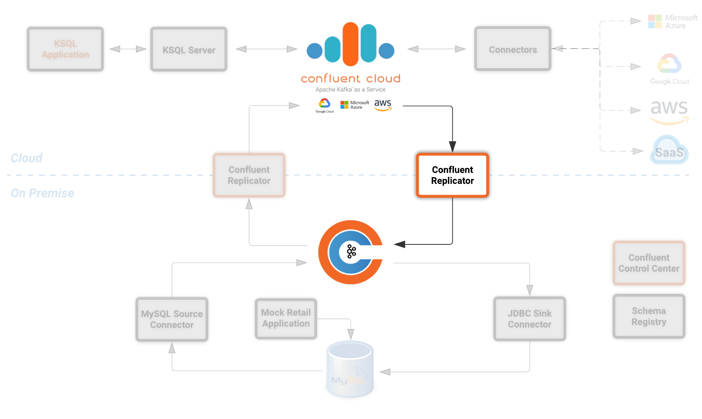

Before we do that, let's create the target topic in our on-premise Kafka cluster using link:http://{externalip}:9021[Confluent Control Center, window=_blank]

Select your on-premise cluster from the left-hand navigation bar, select _"topics"_ and then click on _"Add a Topic"_. 

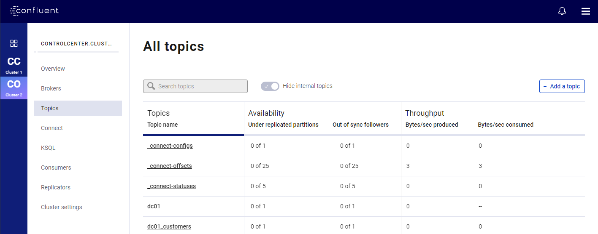

Name the topic `{dc}_out_of_stock_events` with one partition and click _"Create with defaults"_

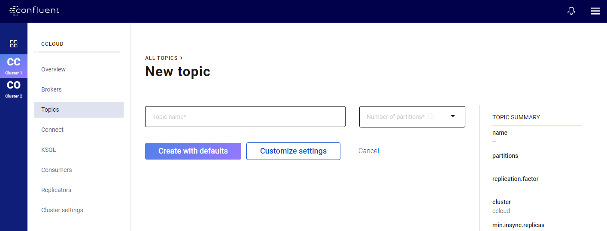

We are now ready to replicate this topic from Confluent Cloud to your on-premise cluster.

=== Submit the Replicator Connector Config

Execute the following from the command line to create the Replicator Connector. You can see that we have asked to only replicate the `{dc}_out_of_stock_events` topic by configuring `"topic.whitelist": "{dc}_out_of_stock_events"`

[source,bash,subs="attributes"]
----
curl -i -X POST -H "Accept:application/json" \
    -H  "Content-Type:application/json" http://localhost:18083/connectors/ \
    -d '{
        "name": "replicator-ccloud-to-{dc}",
        "config": {
          "connector.class": "io.confluent.connect.replicator.ReplicatorSourceConnector",
          "key.converter": "io.confluent.connect.replicator.util.ByteArrayConverter",
          "value.converter": "io.confluent.connect.replicator.util.ByteArrayConverter",
          "topic.config.sync": "false",
          "topic.whitelist": "{dc}_out_of_stock_events",
          "dest.kafka.bootstrap.servers": "broker:29092",
          "dest.kafka.replication.factor": 1,
          "src.kafka.bootstrap.servers": "${file:/secrets.properties:CCLOUD_CLUSTER_ENDPOINT}",
          "src.kafka.security.protocol": "SASL_SSL",
          "src.kafka.sasl.mechanism": "PLAIN",
          "src.kafka.sasl.jaas.config": "org.apache.kafka.common.security.plain.PlainLoginModule required username=\"${file:/secrets.properties:CCLOUD_API_KEY}\" password=\"${file:/secrets.properties:CCLOUD_API_SECRET}\";",
          "src.consumer.group.id": "replicator-ccloud-to-{dc}",
          "src.consumer.interceptor.classes": "io.confluent.monitoring.clients.interceptor.MonitoringConsumerInterceptor",
          "src.consumer.confluent.monitoring.interceptor.bootstrap.servers": "${file:/secrets.properties:CCLOUD_CLUSTER_ENDPOINT}",
          "src.kafka.timestamps.producer.interceptor.classes": "io.confluent.monitoring.clients.interceptor.MonitoringProducerInterceptor",
          "src.kafka.timestamps.producer.confluent.monitoring.interceptor.bootstrap.servers": "${file:/secrets.properties:CCLOUD_CLUSTER_ENDPOINT}",
          "tasks.max": "1"
        }
    }'
----


You should see something similar...

[source,bash,subs="attributes"]
----
HTTP/1.1 100 Continue

HTTP/1.1 201 Created
Date: Sun, 09 Feb 2020 15:07:22 GMT
Location: http://localhost:18084/connectors/replicator-ccloud-to-{dc}
Content-Type: application/json
Content-Length: 1342
Server: Jetty(9.4.20.v20190813)
...
...
----

We can confirm that the `{dc}_out_of_stock_events` is being replicated from Confluent Cloud to our on-premise cluster by checking for messages in link:http://{externalip}:9021[Confluent Control Center, window=_blank]

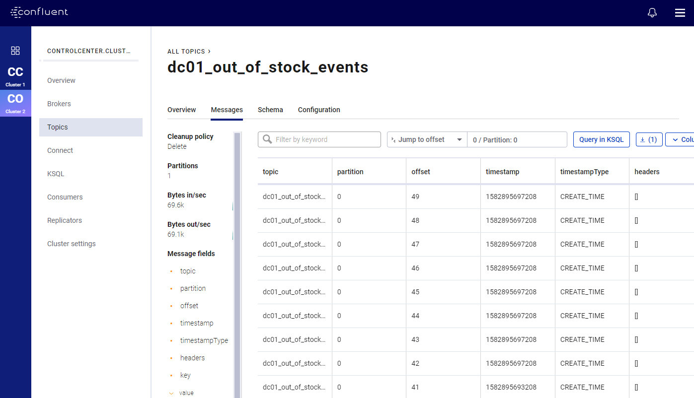

.Further Reading
[TIP]
====
* link:https://docs.confluent.io/current/connect/kafka-connect-replicator/index.html[Confluent Replicator]
* link:https://docs.confluent.io/current/connect/kafka-connect-replicator/configuration_options.html[Confluent Replicator Configuration Properties]
====

== Lab 16: Sink Events into MySQL

Finally we need to sink the `{dc}_out_of_stock_events` topic into a MySQL database table, the on-premise application will then process these events and create purchase order for us.

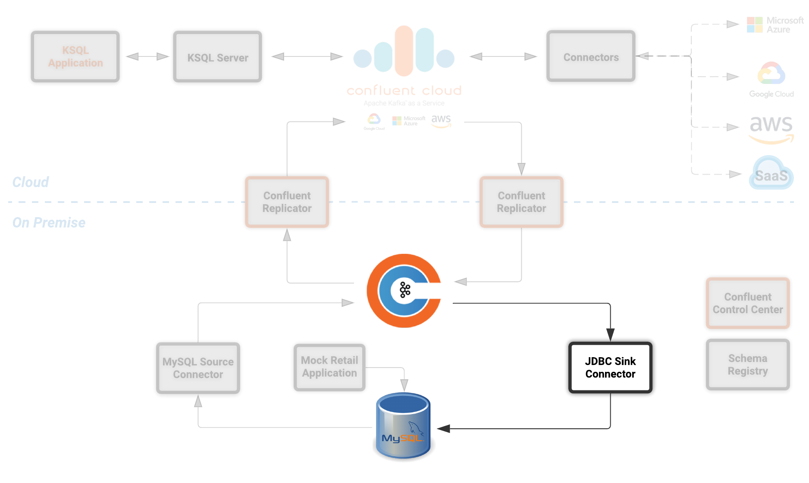

But before we do that, let's open a couple more terminal sessions and start the KSQL CLI in each.

[source,bash,subs=attributes+]
----
ssh {dc}@{externalip}
----

[source,bash,subs=attributes+]
----
docker exec -it ksql-cli ksql http://ksql-server-ccloud:8088
----

Execute the following query in the 1st session...

[source,sql,subs="quotes,attributes"]
----
SET 'auto.offset.reset'='latest';
SELECT  product_id,
        stock_level
FROM  current_stock
EMIT CHANGES;
----

...and this query in the 2nd session

[source,sql,subs="quotes,attributes"]
----
SET 'auto.offset.reset'='latest';
SELECT  product_id,
        product_qty
FROM  purchases_enriched
EMIT CHANGES;
----

You now have a real time view of the current product stock levels in the first KSQL session and the purchases being made to replenish the stock in second. Not that the second query isn't returning anything yet.

Let's now sink the _out of stock events_ to the MySQL database using the JDBC Connector. Once the events start arriving in the database, the orders application will process them and start generating the required purchase orders.

In a third terminal session, create the JDBC Sink Connector by running the following from the command line.

[source,sql,subs="quotes,attributes"]
----
curl -i -X POST -H "Accept:application/json" \
    -H  "Content-Type:application/json" http://localhost:18083/connectors/ \
    -d '{
        "name": "jdbc-mysql-sink",
        "config": {
          "connector.class": "io.confluent.connect.jdbc.JdbcSinkConnector",
          "topics": "{dc}_out_of_stock_events",
          "connection.url": "jdbc:mysql://mysql:3306/orders",
          "connection.user": "mysqluser",
          "connection.password": "mysqlpw",
          "insert.mode": "INSERT",
          "batch.size": "3000",
          "auto.create": "true",
          "key.converter": "org.apache.kafka.connect.storage.StringConverter"
       }
    }'
----

Observe the current stock query in the first KSQL session, when a product has zero or less stock you should see a purchase event appear in the second KSQL session and then the new stock level reflected in the first session. In theory, given a constant demand, each product should run out of stock and get replenished roughly every 3 minutes.

.Further Reading
[TIP]
====
* link:https://docs.confluent.io/current/connect/kafka-connect-jdbc/sink-connector/index.html#jdbc-sink-connector-for-cp[JDBC Sink Connector]
* link:https://docs.confluent.io/current/connect/kafka-connect-jdbc/sink-connector/sink_config_options.html[JDBC Sink Connector Configuration Properties]
====
