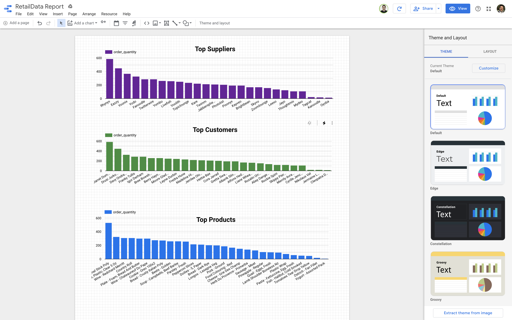

== Visualize your Data in Google Data Studio

Now that your Data is in BigQuery, you can use Google Data Studio to visualize it.

Open link:https://datastudio.google.com[Goodle Data Studio, window=_blank] and create a new Report.
Add new Datasources and select BigQuery. 
You can use the queries below for your convenience (look for the Custom Query in the left sidebar).

Product Query
[source,sql,subs=attributes]
----
SELECT 
  SUM(OD.quantity) as order_quantity,
  AVG(P.price) as avg_product_price,
  P.name as product_name
FROM `gcp-project-id.bigquery_dataset.dc01_sales_order_details` OD 
INNER JOIN `gcp-project-id.bigquery_dataset.dc01_products` P ON OD.product_id = P.id and P.sourcedc="dc01"
WHERE 
OD.sourcedc="dc01"
GROUP BY  P.name
----

Top customers
[source,sql,subs=attributes]
----
SELECT
  COUNT(DISTINCT O.id) as order_count,
  SUM(OD.quantity) as order_quantity,
  SUM(OD.price) as order_price,
  C.first_name || " " || C.last_name as customer_name
FROM `gcp-project-id.bigquery_dataset.dc01_sales_orders` O
INNER JOIN `gcp-project-id.bigquery_dataset.dc01_sales_order_details` OD ON O.id = OD.sales_order_id and OD.sourcedc="dc01"
INNER JOIN `gcp-project-id.bigquery_dataset.dc01_customers` C ON O.customer_id = C.id and C.sourcedc="dc01"
WHERE 
O.sourcedc="dc01"
GROUP BY customer_name
----

Top suppliers
[source,sql,subs=attributes]
----
SELECT
  COUNT(DISTINCT O.id) as order_count,
  SUM(OD.quantity) as order_quantity,
  SUM(OD.price) as order_price,
  S.name AS supplier_name
FROM `gcp-project-id.bigquery_dataset.dc01_sales_orders` O
INNER JOIN `gcp-project-id.bigquery_dataset.dc01_sales_order_details` OD ON O.id = OD.sales_order_id and OD.sourcedc="dc01"
INNER JOIN `gcp-project-id.bigquery_dataset.dc01_suppliers` S ON O.customer_id = S.id and S.sourcedc="dc01"
WHERE 
O.sourcedc="dc01"
GROUP BY supplier_name
----

This is an example of the report you can build:

