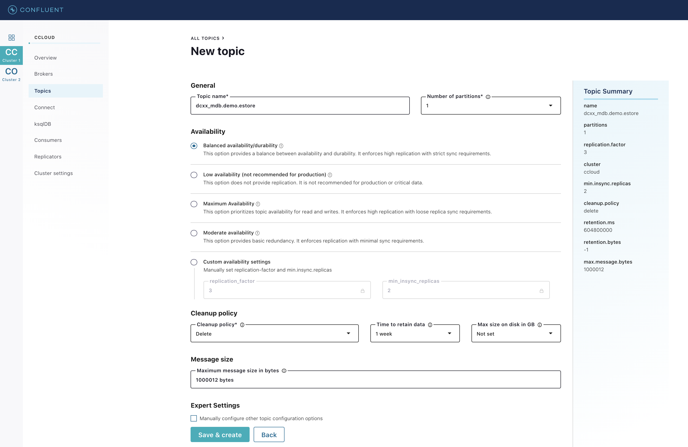

== Optional Lab: Stream Sales & Purchases to MongoDB Atlas

We can use the MongoDB Sink Connector to stream changes from Confluent Cloud to MongoDB Atlas, from here the data can be leveraged in the wider MongoDB ecosystem.

To do this we'll use the ksqlDB CLI to create the connector.

[IMPORTANT]
====
Start a ksqlDB CLI session
[source,subs=attributes]
----
docker exec -it ksqldb-cli ksql http://ksqldb-server-ccloud:8088
----
====

And run the following `CREATE SINK CONNECTOR` command. This will create a connector that will sink the `{dc}_sales_enriched` and the `{dc}_purchases_enriched` topics to MongoDB.

[IMPORTANT]
====
[source,subs=attributes]
----
CREATE SINK CONNECTOR {dc}_mongodb_sink WITH (
  'connector.class'='com.mongodb.kafka.connect.MongoSinkConnector',
  'tasks.max'='1',
  'topics'='{dc}_sales_enriched,{dc}_purchases_enriched',
  'connection.uri'='${file:/secrets.properties:MONGODBATLAS_SRV_ADDRESS}',
  'database'='demo',
  'collection'='{dc}',
  'topic.override.{dc}_sales_enriched.collection'='{dc}_sales',
  'topic.override.{dc}_purchases_enriched.collection'='{dc}_purchases',
  'key.converter'='org.apache.kafka.connect.storage.StringConverter',
  'transforms'='WrapKey',
  'transforms.WrapKey.type'='org.apache.kafka.connect.transforms.HoistField$Key',
  'transforms.WrapKey.field'='ROWKEY',
  'document.id.strategy'='com.mongodb.kafka.connect.sink.processor.id.strategy.UuidStrategy',
  'post.processor.chain'='com.mongodb.kafka.connect.sink.processor.DocumentIdAdder',
  'max.batch.size'='20'
);
----
====

We can list our current connectors using the following command

[source,subs=attributes]
----
show connectors;
----

[source,subs=attributes]
----
 Connector Name            | Type   | Class
------------------------------------------------------------------------------------------------
 {dc}_MONGODB_SINK         | SINK   | com.mongodb.kafka.connect.MongoSinkConnector
 replicator-{dc}-to-ccloud | SOURCE | io.confluent.connect.replicator.ReplicatorSourceConnector
------------------------------------------------------------------------------------------------
----

We can also describe a connector and view its status using the `describe connector` statement.

[source,subs=attributes]
----
describe connector {dc}_MONGODB_SINK;
----
[source,subs=attributes]
----
Name                 : {dc}_MONGODB_SINK
Class                : com.mongodb.kafka.connect.MongoSinkConnector
Type                 : sink
State                : RUNNING
WorkerId             : kafka-connect:18084

 Task ID | State   | Error Trace
---------------------------------
 0       | RUNNING |
---------------------------------
----

Depending on who's hosting the workshop, you may or may not have access to the MongoDB Atlas account where the database is held.

image::./images/mongodb-orders-collection.png[]

Exit the ksqlDB cli 

[IMPORTANT]
====
exit
====

=== Realm triggers
Now that we got our data in MongoDB Atlas, there are multiple things we can do with it.

MongoDB Realm triggers enable you to execute application and database logic automatically, either in response to events or based on a pre-defined schedule. Realm supports three types of triggers:

* **Database triggers**, which can automatically respond when documents are added, updated, or removed in a linked MongoDB collection.
* **Authentication triggers**, which execute additional server-side logic when a user is created, authenticated, or deleted.
* **Scheduled triggers**, which execute functions at regular intervals according to a pre-defined schedule.

Triggers listen for application events of a configured type and are each linked with a specific Realm function. Whenever a trigger observes an event that matches your configuration, it “fires” and passes the event object that caused it to fire as the argument to its linked function. You can configure the events that cause a trigger to fire based on their operation type as well as other values specific to each type of trigger.

In this workshop we configured a Trigger that reads data from the `dc01_sales` collection in MongoDB and writes it to a new collection using a different JSON structure. Below you can see the code of this function.

[source,subs="quotes,attributes"]
----
exports = function(changeEvent) {

    const order = changeEvent.fullDocument;

    let purchaseOrder = {
      'ORDER_ID': order.ORDER_ID,
      'CUSTOMER': {
        'ID': order.CUSTOMER_ID,
        'FNAME': order.CUSTOMER_FNAME,
        'LNAME': order.CUSTOMER_LNAME,
        'EMAIL': order.CUSTOMER_EMAIL,
        'COUNTRY': order.CUSTOMER_COUNTRY,
        'CITY': order.CITY},
      'PRODUCT':{
        'CODE': order.PRODUCT_ID,
        'QUANTITY': order.PRODUCT_QTY},
      'DATE':{
        'ORDERED': order.ORDER_DATE}
    };

    var collection = context.services.get("mongodb-atlas").db("demo").collection("po");
    collection.insertOne(purchaseOrder);

};
----

=== Realm application
MongoDB Atlas is a great platform to build modern and scalable applications. These applications can now leverage all the data retrieved in real time from your legacy systems as it is now in MongoDB Atlas ready to be used. 
These applications will also produce new data, what if you need to communicate these information back to your on premise environment? Let's have a look!

The application is already deployed in MongoDB Atlas and lets you put Orders online, with a simple web application. 

link:MONGODB_REALM_APP_URL[Place your first order at this link, window=_blank]

image::./images/mongodb-realm-app.png[]

The application itself is hosted in MongoDB Atlas, and the data inserted from the UI will flow in the collection `demo.po`

=== MongoDB Source Connector
Now  your customers can place orders from this brand new web applications! That's great but... how do you tie this with your backend processes? Let's get this new data back to on-premise!

In this case we'll get it to Confluent Cloud first. Let's create a topic to send this data to.

We can use link:http://{externalip}:9021[Confluent Control Center, window=_blank] to do this. 

[IMPORTANT]
====
Create the `{dc}_mdb.demo.estore` topic.

Select the "CC" cluster from the left-hand navigation bar and then select "Topics". 

Click on "+ Add Topic"

Input `{dc}_mdb.demo.estore` as _Topic Name_, and select 1 for _Number of partitions_

Click on _Customize settings_

Select _Balanced availability/durability_ as _Availability_ type 

Select _Delete_ as _Cleanup policy_

Click on _Save & create_

====

Now everything is ready to create the MongoDB Source Connector. Every Time you will place an order using the demo web store , these orders are persisted in MongoDB. We'll read the collection that contains these orders, and produce these events to the `{dc}_mdb.demo.estore` topic

[IMPORTANT]
====
[source,subs=attributes]
----
curl -i -X POST -H "Accept:application/json" \
  -H  "Content-Type:application/json" http://localhost:18084/connectors/ \
  -d '{
      "name": "{dc}_mongodb_source",
      "config": {
        "connector.class":"com.mongodb.kafka.connect.MongoSourceConnector",
        "tasks.max":1,
        "key.converter":"org.apache.kafka.connect.storage.StringConverter",
        "value.converter":"org.apache.kafka.connect.storage.StringConverter",
        "connection.uri":"${file:/secrets.properties:MONGODBATLAS_SRV_ADDRESS}",
        "database":"demo",
        "collection":"estore",
        "topic.prefix": "{dc}_mdb"
      }
  }'
----
====

=== Replicate MongoDB orders to On-Premise Kafka
Now that the data is in Confluent Cloud, you could sync it back to On-Premise Kafka, and then to MySQL using similar steps you have already followed in this workshop. This step is optional, and will not be explained step by step. Have fun!

.Further Reading
[TIP]
====
* link:https://www.mongodb.com/cloud/atlas[MongoDB Atlas]
* link:https://github.com/mongodb/mongo-kafka[MongoDB Kafka Connector]
* link:https://docs.mongodb.com/realm/triggers[Realm Triggers]
====