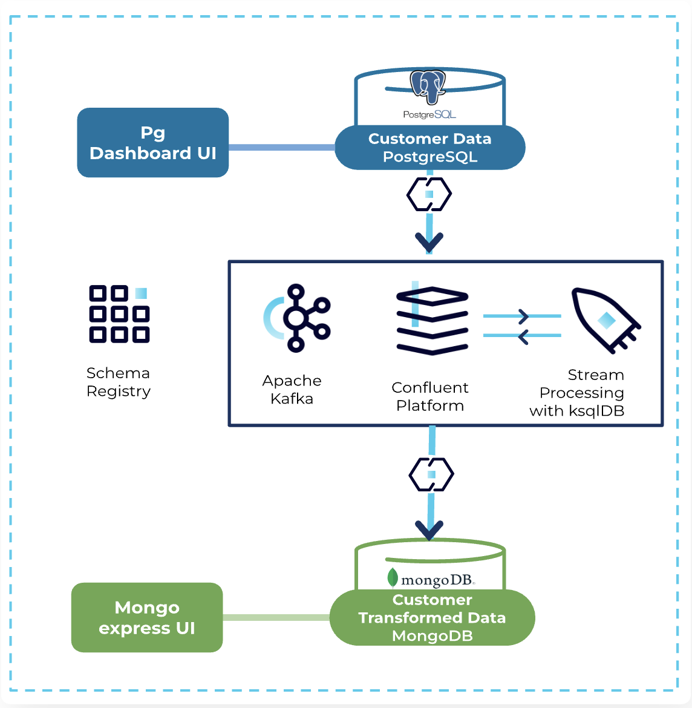

# Confluent Workshop - Kafka Connect - From Postgres To MongoDB

## Overview

This repository allows you to configure and provision a Docker-based workshop in your local machine. The workshop is intended to act as a psuedo on-premise datacenter. 
The environment has a Postgres database, Confluent Platform and a MongoDB database. It also has browser UI for each component for the ease of connecting to them.

Each workshop participant will work through a series of Labs to perform Database Modernization, using Connectors for data flow between Apache Kafka® and Databases, and using KsqlDb for data processing.

For a single workshop participant, the logical architecture looks like this.



## Prerequisites

* Docker installed.
* Python + [Yaml](https://pyyaml.org/wiki/PyYAML)

## Provisioning a Workshop

There is a file called .env which you need to check before starting in case you want to modify some values:

```
DC=<User name for the workshop>
PASS=<User password for the workshop>
CONFLUENT_DOCKER_TAG=<Docker Confluent images for the workshop>
```
After filling the previous env variables, execute the following command in the local-environment folder:

```
. ./.env
```
Execute the docker-compose.yml file that is on the local-environment folder.

```
docker-compose up -d
```

Maybe it takes some minutes to download the images. 

Once all the images have been downloaded you can check if everything is uo and running executing:
```
docker ps --format "table {{.ID}}\t{{.Names}}\t{{.RunningFor}}\t{{.Status}}"
```

You shpuld see an output like this:

```
CONTAINER ID   NAMES                     CREATED          STATUS
7c6cd68d890c   control-center            9 seconds ago    Up 2 seconds
2e61deea23a1   ksqldb-cli                9 seconds ago    Up 2 seconds
cacf3e472c17   ksqldb-server             9 seconds ago    Up 3 seconds
860e796c604d   connect                   9 seconds ago    Up 4 seconds (health: starting)
fde2dab115cf   rest-proxy                9 seconds ago    Up 4 seconds
1dc35b325f80   schema-registry           10 seconds ago   Up 5 seconds
5e1134678238   mongo-express             10 seconds ago   Up 6 seconds
1242dd4b6cf9   broker                    10 seconds ago   Up 6 seconds
1c541b2e274b   mymongodb                 10 seconds ago   Up 6 seconds
6bfbe30e632c   workshop-docs-webserver   10 seconds ago   Up 7 seconds
0a769144179a   zookeeper                 10 seconds ago   Up 6 seconds
7cbe95e278cb   pg_dashboard              10 seconds ago   Up 7 seconds
5bebbde5b81b   postgres-db               10 seconds ago   Up 6 seconds

```

The workshop is already provisioned and now you can open your browser and go to http://localhost:8080/.

You should be able to see the workshop documentation to be able to complete the labs.

When you are finished with the workshop you can destroy it using the following command:

```
docker-compose down
```

## License

This project is licensed under the Apache 2.0 - see the [LICENSE.md](LICENSE.md) file for details
